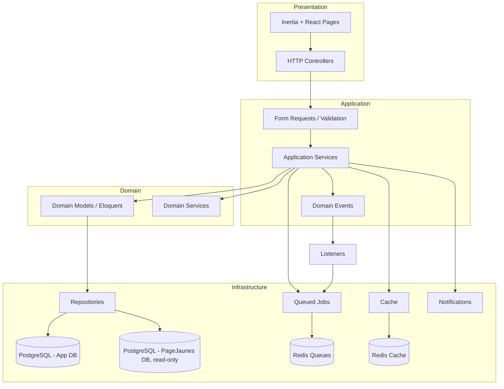
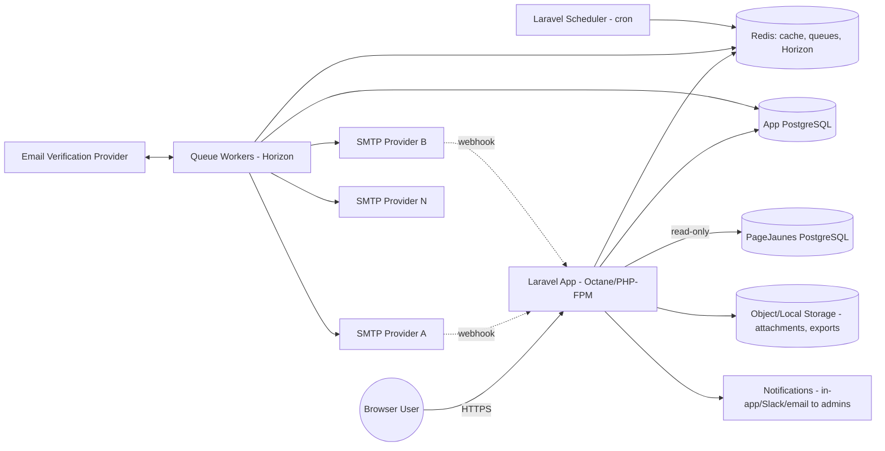
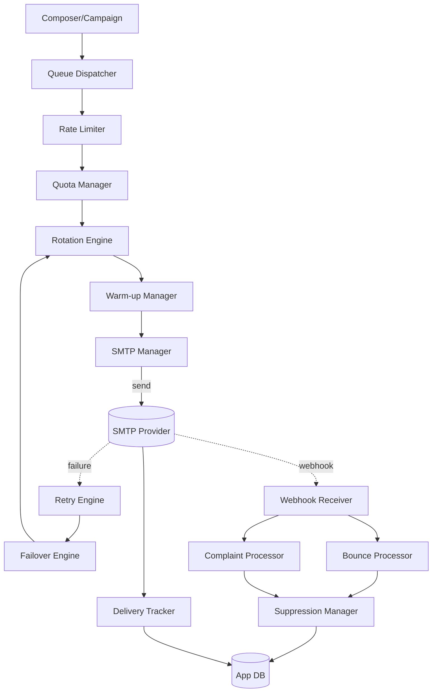
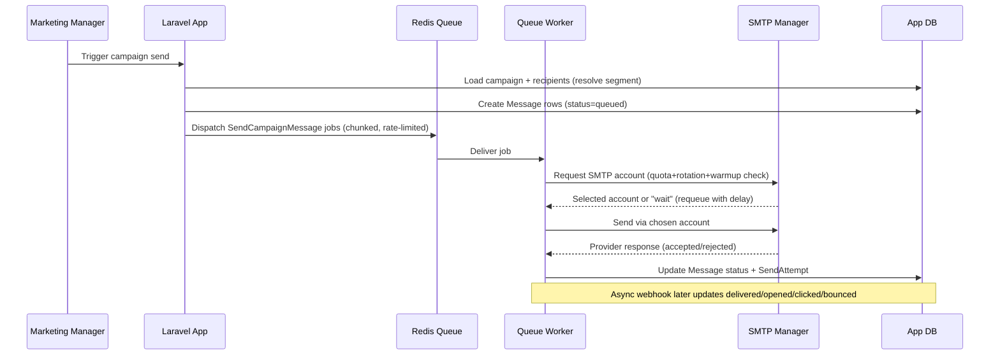

# 02 — System Architecture

## 2.1 Architectural Style

PageJaunes Mailer is a **modular monolith** built on Laravel 12, organized into bounded-context modules communicating through Application Services, Domain Events, and Queued Jobs. It is service-oriented in design (clear service boundaries, single-responsibility classes) without the operational overhead of separate microservices, since it serves a single organization.

Guiding principles: SOLID, layered architecture, CQRS-lite (explicit read/query services vs. write/command services for high-traffic modules like delivery tracking and reporting), event-driven side effects, and queue-first for anything I/O-bound or rate-limited (all SMTP sending).

> Formal bounded-context boundaries and integration patterns for the module list below are specified in [35-domain-driven-design.md](35-domain-driven-design.md); the full C4 Context/Container/Component/Code diagram set (extending the Container diagram in §2.4 below) is in [36-c4-architecture.md](36-c4-architecture.md).

## 2.2 Layered Architecture

### Layer Responsibilities

| Layer | Responsibility | Laravel Constructs |
|---|---|---|
| Presentation | Render pages, capture input, client-side state | Inertia pages, React components, Form Requests |
| Application | Orchestrate use cases, authorize, transactional boundaries | Controllers (thin), Application Services, Policies |
| Domain | Business rules, invariants, state machines | Eloquent Models, Domain Services, Value Objects, Enums |
| Infrastructure | Persistence, external systems, queueing, caching | Repositories, Eloquent, Jobs, Events/Listeners, Notifications |

**Rule:** Controllers never contain business logic. Controllers call one Application Service method, translate the result to an Inertia response. Application Services orchestrate Domain Services and Repositories and raise Domain Events; they do not talk to Eloquent directly for anything beyond simple lookups — non-trivial queries go through Repositories.

## 2.3 Module (Bounded Context) Decomposition

| Module | Responsibility | Key Entities |
|---|---|---|
| `Identity` | Users, roles, permissions, sessions | User, Role, Permission |
| `Mailbox` | Inbox/Sent/Drafts/Outbox UI aggregation | (reads from Messages module) |
| `Composer` | Draft composition, versioning, attachments, signatures | Draft, DraftVersion, Signature, Attachment |
| `Templates` | HTML template library and editor | Template, TemplateVersion, TemplateBlock |
| `Recipients` | Contacts, lists, segments, tags | Recipient, RecipientList, Segment, Tag |
| `Importing` | CSV/Excel/PageJaunes import pipelines | ImportJob, ImportRow, ImportError |
| `PageJaunesIntegration` | Read-only external DB access, sync cache | PageJaunesCompanyCache |
| `Campaigns` | Campaign lifecycle, scheduling, recurrence | Campaign, CampaignRecipient, CampaignSchedule |
| `DeliveryEngine` | SMTP selection, quota, rate limiting, rotation, warm-up, retry/failover | SmtpAccount, QuotaLedger, SendAttempt |
| `Tracking` | Delivery status, opens, clicks, webhooks | Message, MessageEvent, ClickLink |
| `Verification` | Email address validation | VerificationResult |
| `Suppression` | Suppression list management | SuppressionEntry |
| `Queues` | Queue monitoring dashboards (wraps Horizon) | — (Horizon-managed) |
| `Reporting` | Aggregated analytics | ReportSnapshot (materialized views) |
| `Audit` | Audit trail | AuditLog |
| `Settings` | System configuration | SettingValue |

Each module maps to a top-level namespace under `app/Modules/{ModuleName}` — see [03-folder-structure.md](03-folder-structure.md).

## 2.4 Component / Container Diagram (C4 Level 2)

## 2.5 Delivery Engine Service Decomposition

Detailed in [17-delivery-engine.md](17-delivery-engine.md); summarized here for architectural context:

## 2.6 Data Flow: Campaign Send (High Level)

## 2.7 Caching Strategy

| Cache | Store | TTL | Purpose |
|---|---|---|---|
| PageJaunes company lookup cache | Redis | 24h (configurable) | Avoid repeated external DB round-trips |
| Quota counters (per SMTP account, per window) | Redis (atomic counters) | Rolling window | Real-time throttling decisions |
| Segment evaluation result | Redis | 15 min or on recipient-data change | Avoid re-running expensive segment queries per send |
| Settings | Redis (config cache) | Until invalidated on write | Avoid DB hit per request for system settings |
| Report snapshots | Postgres materialized views + Redis for hot summaries | Refreshed on schedule (every 15 min) | Fast dashboard/report loads |

## 2.8 Storage Strategy

- **Attachments**: Laravel filesystem abstraction, default `local` disk in dev, S3-compatible disk in staging/production (see [33-deployment.md](33-deployment.md)). Never stored inline in DB.
- **Imports (CSV/Excel)**: Uploaded to a private disk, processed by queued jobs, retained per retention policy (default 30 days) for audit/reprocessing, then pruned by scheduled job.
- **Exports (reports, recipient lists)**: Generated to private disk, served via signed temporary URLs, pruned after 7 days.

## 2.9 Scheduling Strategy

Laravel Scheduler (`app/Console/Kernel.php` equivalent in L12 `routes/console.php` scheduling) drives:
- Campaign due-check (every minute) → dispatches campaigns whose `scheduled_at` has arrived.
- Quota window resets (every minute) — actually enforced via Redis TTL/rolling windows, scheduler only reconciles/report.
- Warm-up stage advancement (daily).
- Suppression/bounce reconciliation sweep (hourly) as a safety net in addition to webhook-driven updates.
- Report snapshot refresh (every 15 minutes).
- Import/export file pruning (daily).
- SMTP health check probes (every 5 minutes).

Full catalog: [30-background-jobs.md](30-background-jobs.md).

## 2.10 Event-Driven Backbone

Domain Events decouple modules. Example: `MessageBounced` event is fired by the Tracking module; `Suppression` module listens and adds a suppression entry; `Audit` module listens and writes an audit log; `Reporting` module listens and increments counters. See [31-events.md](31-events.md) for the full catalog and listener map.

## 2.11 Notifications

Laravel Notifications used for **internal** alerting only (not the marketing email itself, which flows through the Delivery Engine): SMTP account health degraded, quota near-exhaustion, campaign completed, import finished/failed, queue backlog threshold exceeded. Channels: database (in-app bell), mail (to admins), optionally Slack webhook (configurable in Settings). The full in-app Notification Center (bell UI, per-user/per-category channel preferences, read/unread state) built on top of this mechanism is specified in [41-notification-center.md](41-notification-center.md).

## 2.12 Non-Functional Requirements

| Concern | Target |
|---|---|
| Availability | 99.5% (single-org internal tool, business-hours criticality) |
| Send throughput | Configurable per SMTP account; system must support ≥ 50,000 messages/day aggregate across accounts |
| API p95 latency | < 300ms for read endpoints, < 800ms for write endpoints excluding bulk import |
| Horizontal scaling | Stateless web tier + Octane; queue workers scale independently by queue name |
| Data retention | Messages/events retained indefinitely unless purged by admin policy; imports 30 days; exports 7 days |

## 2.13 Technology Rationale

- **Laravel Horizon**: first-class Redis queue observability, required by the "Advanced Queue Monitoring" feature.
- **Sanctum**: SPA session-based auth is sufficient for a single-organization internal app; avoids OAuth complexity.
- **Inertia.js**: allows Laravel routing/controllers to remain the source of truth for navigation while delivering a React SPA experience — fits the "no separate API-only frontend" constraint while still exposing a versioned JSON API (29) for integrations/webhooks.
- **Fluent UI v9**: chosen specifically because the UX is Outlook-inspired; Fluent is Microsoft's own design system and ships Outlook-like primitives (command bar, pivot, persona, message bar).

Continue to [03-folder-structure.md](03-folder-structure.md).
