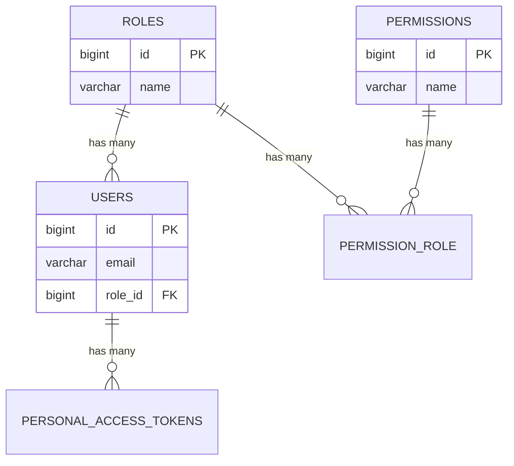
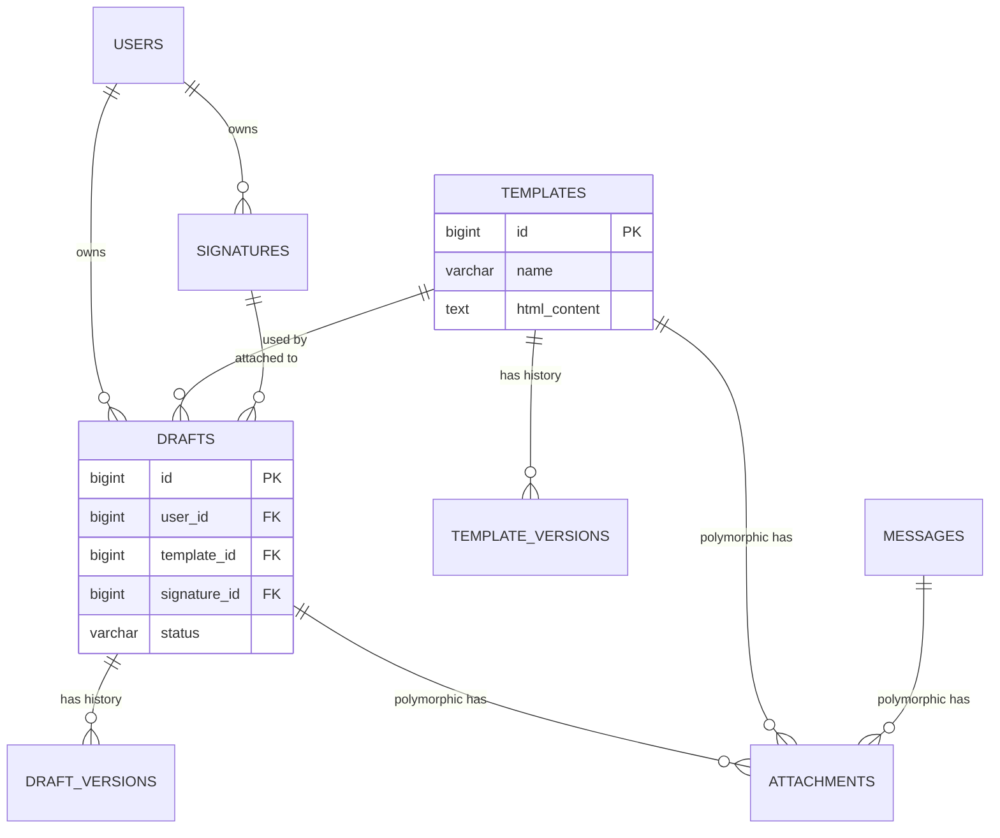
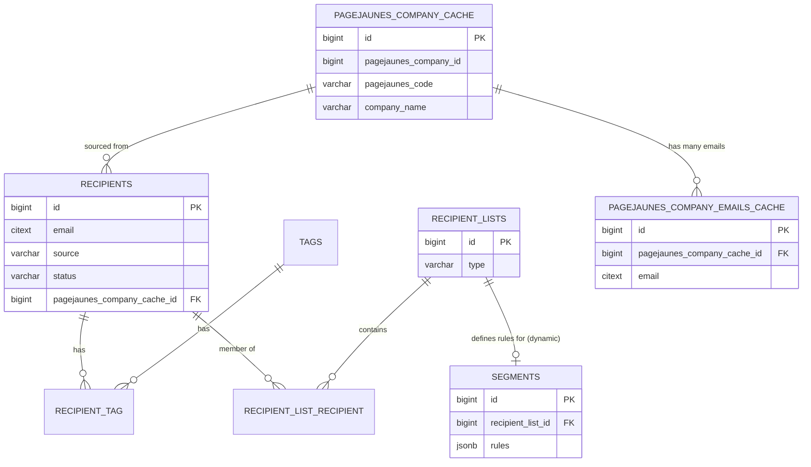
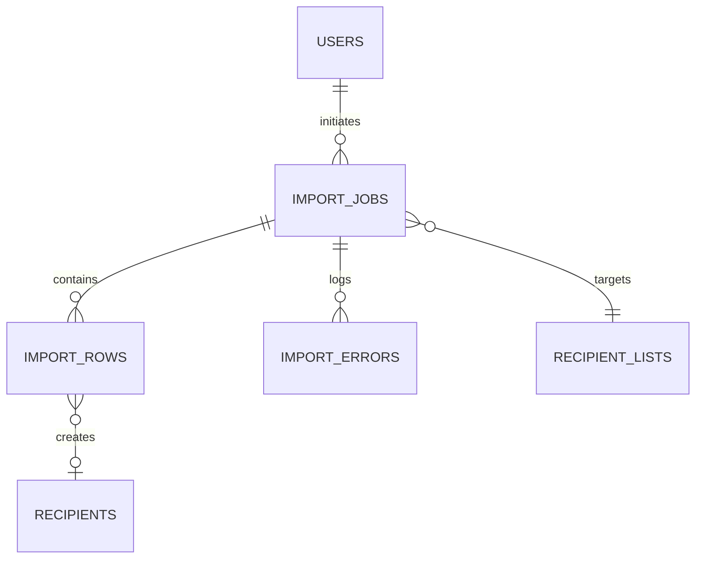
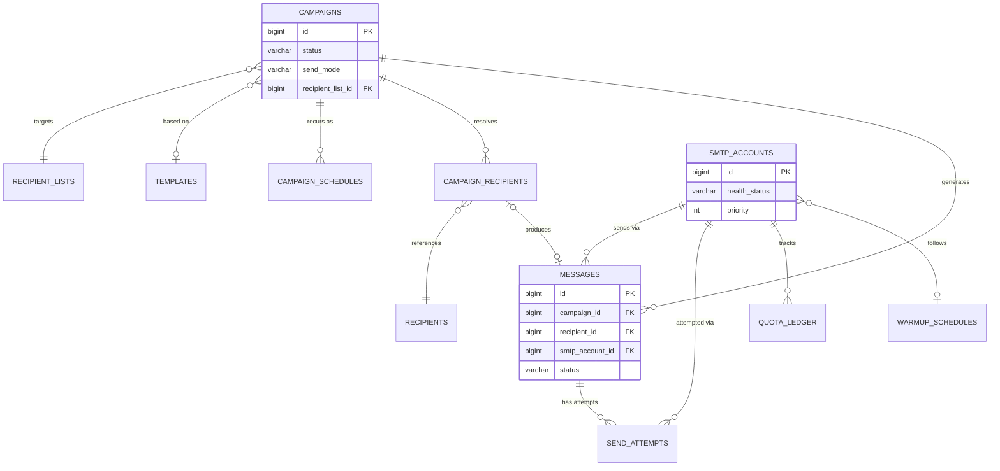
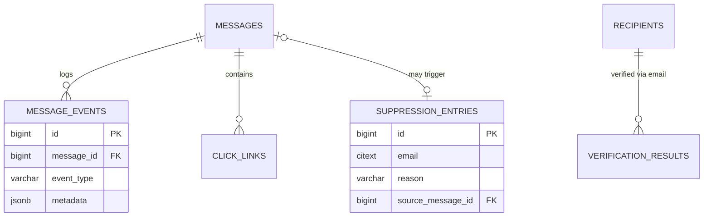
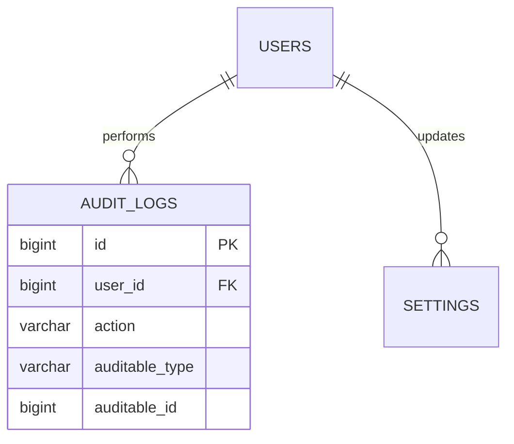
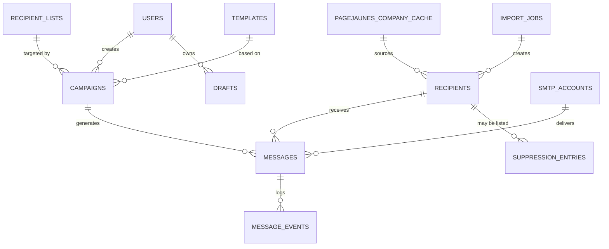

# 05 — Entity-Relationship Diagrams

Full column-level detail is in [04-database-design.md](04-database-design.md). These diagrams show cardinality and key relationships grouped by domain area for readability.

## 5.1 Identity & Access

## 5.2 Composer, Templates & Attachments

## 5.3 Recipients & Segmentation

> Note: the external PageJaunes source (`pjnewdb`) is a MariaDB/MySQL database, not PostgreSQL — `PAGEJAUNES_COMPANY_CACHE`/`PAGEJAUNES_COMPANY_EMAILS_CACHE` above are our own Postgres cache tables mirroring it, per [06-pagejaunes-integration.md](06-pagejaunes-integration.md). A company can have zero or many emails, which is why the cache mirrors that as a child table rather than a single `email` column.

## 5.4 Import Pipeline

## 5.5 Campaigns & Delivery

## 5.6 Tracking, Verification & Suppression

## 5.7 Governance (Audit, Settings)

## 5.8 Full Cross-Domain Overview (Simplified)

Continue to [06-pagejaunes-integration.md](06-pagejaunes-integration.md).
