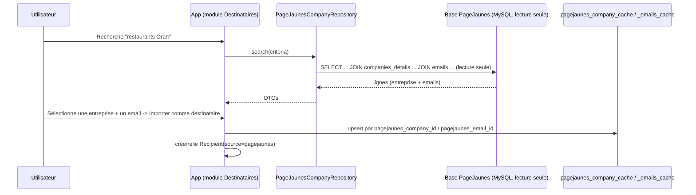

# 06 — PageJaunes Database Integration

## 6.1 Overview

PageJaunes Mailer sources company/recipient data from a **real, pre-existing external database**: `pjnewdb`, a **MariaDB 10.11 / MySQL-compatible** database (not PostgreSQL — this is a different engine than the application's own database, which matters for the connection layer, see 6.2). The integration is strictly **read-only**. Confirmed source tables relevant to this integration:

| Source Table | Role |
|---|---|
| `companies` | Core company record — name, legal/administrative metadata, location, publication status |
| `companies_details` | 1:1 extension of `companies` — headcount, geo coordinates, social links, banners |
| `emails` | **One-to-many** child of `companies` — a company may have zero, one, or several email addresses |

`companies` also carries foreign keys to lookup tables we do **not** mirror wholesale (`legal_forms`, `countries`, `wilayas`, `localities`, `publications`, `states`, `legal_regimes`, `types`, `clients`, and the source's own `users` for `created_by`) — at sync time we resolve these to their human-readable **label** only (see 6.3), since we don't need to replicate the source's full administrative taxonomy, just display it.

Local cache tables `pagejaunes_company_cache` and `pagejaunes_company_emails_cache` are defined in [04-database-design.md §4.7](04-database-design.md#47-pagejaunes-integration-module); this document covers the connection, sync, and workflow architecture around them.

## 6.2 Connection Strategy

- A second Laravel database connection, name `pagejaunes`, uses the **`mysql`** driver (distinct from the app's own `pgsql` default connection) — Laravel supports mixed-driver multi-connection setups natively, so this is a configuration-only concern, not an architectural complication.
- Configured in `config/pagejaunes.php` / a `pagejaunes` entry in `config/database.php`: `DB_CONNECTION=mysql`, host, port, `database=pjnewdb`, username, password via env vars (`PAGEJAUNES_DB_*`), `charset=utf8mb4`, `collation=utf8mb4_general_ci` (matching the source's declared charset/collation exactly, to avoid comparison/sorting mismatches on `company_name` etc.).
- The database user configured for this connection is granted **`SELECT` only** at the MySQL/MariaDB grant level on `pjnewdb` — enforced by the actual DB privileges, not just application convention (mirrors the enforcement approach used for the app's own audit table, see [28-security.md](28-security.md)).
- All access goes through a single `PageJaunesCompanyRepository` in the `PageJaunesIntegration` module; no other code references the `pagejaunes` connection directly.
- `companies.deleted_at` (soft delete) and `emails.deleted_at`/`companies_details.deleted_at` are always respected: any query against this connection excludes soft-deleted source rows (`WHERE deleted_at IS NULL`) as a baseline, non-optional filter in the repository.
- Connection pool sized conservatively (default 5); a connection outage here never affects core app functionality — see 6.7.

## 6.3 Source → Cache Field Mapping

| Source (`pjnewdb`) | Our Cache Column | Notes |
|---|---|---|
| `companies.id` | `pagejaunes_company_cache.pagejaunes_company_id` | stable numeric identity |
| `companies.code` | `pagejaunes_company_cache.pagejaunes_code` | source's own unique business key |
| `companies.company_name` | `company_name` | |
| `companies.abv_company_name` | `abv_company_name` | |
| `companies.slug` | `slug` | |
| `companies.legal_form_id` → `legal_forms.name`-equivalent | `legal_form_label` | resolved via join at sync time, label only |
| `companies.countrie_id` → `countries` | `country_label` | resolved label (note source's own column typo `countrie_id`, not our concern beyond mapping it correctly) |
| `companies.wilaya_id` → `wilayas` | `wilaya_label` | Algerian province/region — a key search/filter dimension |
| `companies.localitie_id` → `localities` | `locality_label` | resolved label |
| `companies.Address` | `address` | |
| `companies.about` | `about` | |
| `companies.distributor`/`exportation`/`importation`/`producer`/`customer` | `is_distributor`/`is_exporter`/`is_importer`/`is_producer`/`is_customer` | tinyint(0/1) → boolean |
| `companies.created_at` | `source_created_at` | |
| `companies.deleted_at` | `source_deleted_at` | non-null excludes from active search (6.5) |
| `companies_details.nb_employee` | `nb_employee` | |
| `companies_details.facebook`/`linkedin`/`instagram`/`youtube`/`tiktok`/`twitter` (+ `*_name` companions) | folded into `raw_source_data` jsonb | not promoted to dedicated columns since not used for recipient targeting, but retained for the company detail view |
| `companies_details.popup_image`/`ad_banner`/`geo_x`/`geo_y` | folded into `raw_source_data` jsonb | same rationale |
| `companies.main_picture` | `main_picture_url` | |
| `emails.id` | `pagejaunes_company_emails_cache.pagejaunes_email_id` | |
| `emails.mail` | `pagejaunes_company_emails_cache.email` | |
| `emails.company_id` | `pagejaunes_company_emails_cache.pagejaunes_company_cache_id` | resolved to our cache row's own `id`, not the raw source FK |
| `emails.deleted_at` | `pagejaunes_company_emails_cache.source_deleted_at` | |

Fields we deliberately do **not** promote to dedicated columns (`plan_id`, `plan_started_at`/`plan_expires_at`, `completion_percentage`, `parent_id`, `client_id`, `type_id`, `state_id`, `legal_regime_id`, `pub_debut`/`pub_fin`, `modification`, `old_company_id`) are internal to the PageJaunes product's own subscription/publication workflow and irrelevant to recipient sourcing for this platform; they are **not** even retained in `raw_source_data` unless a future need is identified (kept out to avoid mirroring unrelated business logic we don't own).

## 6.4 Repository Layer

`PageJaunesCompanyRepository` (all queries run against the `pagejaunes` MySQL connection, `SELECT` only, always filtering out soft-deleted rows):
- `search(criteria): Collection` — joins `companies` → `companies_details` (left join) and aggregates matching `emails` rows, filtered by name/wilaya/locality/sector-equivalent keyword; used for the on-demand Recipient-picker search.
- `findByExternalId(companyId): ?PageJaunesCompanyDto` — single company + its emails.
- `fetchBatch(sinceId, limit): Collection` — cursor-paginated (`WHERE id > sinceId ORDER BY id LIMIT ...`) sweep for the scheduled bulk sync job.

The repository maps raw MySQL rows into a stable `PageJaunesCompanyDto` (with a nested `emails: string[]`) per the mapping table in 6.3, so the rest of the application never touches source column names directly — if the source schema changes, only this repository's mapping changes.

## 6.5 Synchronization Strategy

Two complementary modes, unchanged in shape from the general integration pattern, now precise about the real schema:

1. **On-demand lookup (search-time caching)** — a user searching the Recipient picker triggers a live `search()` against `pjnewdb`; on selection, the chosen company (and its `emails` rows) are immediately upserted into `pagejaunes_company_cache` / `pagejaunes_company_emails_cache` (keyed by `pagejaunes_company_id` / `pagejaunes_email_id`) before being used to create/link `recipients`.
2. **Scheduled bulk sync** (`SyncPageJaunesCompaniesJob`, daily, configurable) — cursor-paginated sweep of `companies` (joined to `companies_details` and `emails`) upserting into both cache tables, refreshing `raw_source_data`/`synced_at`. Companies whose `companies.deleted_at` is now non-null (removed/unpublished at the source since the last sync) have their cache row's `source_deleted_at` updated to match and are excluded from future search/import — **already-created `recipients` are never retroactively deleted**, only the cache linkage is marked stale.

## 6.6 Duplicate Prevention

- `pagejaunes_company_cache.pagejaunes_company_id` and `pagejaunes_code` are both unique — re-importing the same company never creates a duplicate cache row.
- `pagejaunes_company_emails_cache.pagejaunes_email_id` is unique — the same source email row is never cached twice.
- `recipients.email` is unique (case-insensitive `citext`); since a single `companies` row can yield **multiple emails**, each distinct email becomes (at most) one `recipients` row, all sharing the same `pagejaunes_company_cache_id` link — the UI presents "this company has N email addresses" and lets the user choose all, one, or a subset to import as recipients, rather than assuming a single canonical company email.
- Importing an email that already matches an existing `recipients.email` links/enriches the existing recipient (sets `pagejaunes_company_cache_id` if not already set, merges `company_name`/custom fields) rather than duplicating, consistent with [13-recipient-management.md §13.4](13-recipient-management.md#134-duplicate-detection).

## 6.7 Email Import Workflow

1. User searches/filters PageJaunes companies (by name, wilaya, locality, distributor/exporter/importer/producer flags) in Recipients → "Importer depuis PageJaunes."
2. Results (paginated, live query) show each company with its associated email count and whether it's already linked to a recipient.
3. User expands a company to see its individual `emails` and multi-selects at the email level (not just company level, since one company can map to several recipients) — or uses "select all emails for all matching companies" up to a safety cap (default 5,000 emails per operation).
4. Selection submitted as an `ImportJob` (`source_type = pagejaunes`), processed asynchronously per [14-import-export.md](14-import-export.md), with the payload being a list of `{company_id, email_id}` pairs rather than company IDs alone.
5. Per selected pair: upsert company + email into cache → syntax-validate email → dedupe against existing `recipients` → create `Recipient` (`source = pagejaunes`, `pagejaunes_company_cache_id` set) → optionally attach to a target `RecipientList`.
6. Companies with **zero** `emails` rows are still shown in search results (useful for browsing the directory) but cannot be selected for recipient import — surfaced with a "Pas d'email disponible" (no email available) indicator rather than being hidden, since users may still want to see/reference such companies.

## 6.8 Error Handling & Resilience

Unchanged in principle from the general architecture (timeout + circuit breaker + graceful degradation, see [02-system-architecture.md](02-system-architecture.md)), now specific to a MySQL failure mode: connection/auth errors against the `pagejaunes` MySQL connection are caught distinctly from the app's own Postgres connection errors (different exception classes per driver), ensuring a `pjnewdb` outage is never misreported as an app-database problem in logs/alerts. All external DB calls wrapped with a timeout (default 5s) and circuit breaker (cooldown after N consecutive failures); scheduled sync failures trigger an admin Notification and retry with backoff ([30-background-jobs.md](30-background-jobs.md)); raw MySQL errors/connection details are never exposed to the frontend.

## 6.9 Caching Strategy (Application-Level)

Hot search queries additionally cached in Redis (5-minute TTL, keyed by normalized search criteria) to reduce load on `pjnewdb`, unchanged from the general pattern in [02-system-architecture.md §2.7](02-system-architecture.md#27-caching-strategy).

Continue to [07-ui-design.md](07-ui-design.md).
