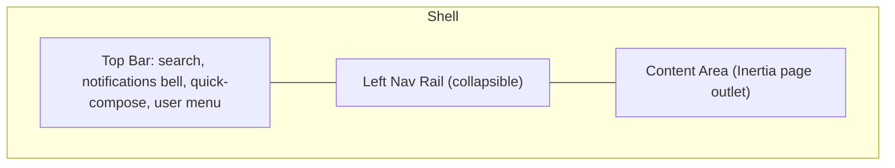

# 08 — Navigation & Information Architecture

## 8.1 App Shell Layout



Three persistent regions: **Top Bar** (global search, notification bell, quick "New Email" button, user/account menu), **Nav Rail** (primary IA, collapsible to icon-only), **Content Area** (renders the current Inertia page, itself often subdivided into list/reading-pane/detail panes per module).

## 8.2 Primary Navigation Tree

```
Dashboard
Mail
  ├─ Inbox            (transactional replies/bounce notices routed here if applicable)
  ├─ Drafts
  ├─ Outbox
  ├─ Scheduled
  └─ Sent Items
Campaigns
  ├─ All Campaigns
  ├─ New Campaign
  └─ Recurring Schedules
Templates
  ├─ Template Library
  └─ Block Library
Recipients
  ├─ All Recipients
  ├─ Lists & Segments
  ├─ Tags
  ├─ Import
  └─ Import from PageJaunes
Email History           (searchable message log across all sends)
SMTP
  ├─ SMTP Accounts
  ├─ Health & Rotation
  └─ Throttling Rules
Queues                  (Horizon-backed monitoring dashboard)
Reporting
  ├─ Delivery Reports
  ├─ Campaign Comparison
  ├─ Template Performance
  └─ SMTP Performance
Suppression List
Verification            (bulk/ad hoc email verification tool)
Administration
  ├─ Users & Roles
  ├─ Audit Logs
  └─ Settings
      ├─ General / Branding
      ├─ Tracking Domain
      ├─ Throttling Defaults
      ├─ Verification Provider
      └─ Notifications
```

## 8.3 Route Map (Inertia Web Routes, illustrative)

| Path | Page Component | Notes |
|---|---|---|
| `/dashboard` | `Dashboard/Index` | Default landing page |
| `/mail/inbox` | `Mailbox/Inbox` | |
| `/mail/drafts` | `Mailbox/Drafts` | |
| `/mail/outbox` | `Mailbox/Outbox` | |
| `/mail/scheduled` | `Mailbox/Scheduled` | |
| `/mail/sent` | `Mailbox/Sent` | |
| `/compose` | `Composer/Index` | Also opens as overlay from any page |
| `/compose/{draft}` | `Composer/Index` | Edit existing draft |
| `/templates` | `Templates/Index` | |
| `/templates/{template}/edit` | `Templates/Edit` | |
| `/recipients` | `Recipients/Index` | |
| `/recipients/lists` | `Recipients/Lists` | |
| `/recipients/lists/{list}` | `Recipients/ListDetail` | |
| `/recipients/import` | `Recipients/Import` | CSV/Excel |
| `/recipients/import/pagejaunes` | `Recipients/PageJaunesImport` | |
| `/campaigns` | `Campaigns/Index` | |
| `/campaigns/new` | `Campaigns/Wizard` | |
| `/campaigns/{campaign}` | `Campaigns/Detail` | Tabs: Overview/Recipients/Content/Analytics |
| `/history` | `EmailHistory/Index` | |
| `/smtp` | `Smtp/Index` | |
| `/smtp/{account}` | `Smtp/Detail` | |
| `/queues` | `Queues/Dashboard` | |
| `/reporting/*` | `Reporting/*` | |
| `/suppression` | `Suppression/Index` | |
| `/verification` | `Verification/Index` | |
| `/admin/users` | `Admin/Users` | |
| `/admin/audit-logs` | `Admin/AuditLogs` | |
| `/settings/*` | `Settings/*` | |

Full API surface (JSON) documented separately in [29-api-specification.md](29-api-specification.md); the routes above are Inertia page routes returning full page props, not the JSON API.

## 8.4 Navigation Behavior

- Nav rail items filtered by the current user's role/permissions (see [26-rbac.md](26-rbac.md)) — an item is hidden entirely (not just disabled) if the user has no permission for any action within it.
- Active route highlighted with brand-colored left border + filled icon variant (Outlook convention).
- Unread/pending counts shown as `CounterBadge` on: Inbox (unread bounce/reply notices), Outbox (pending count), Scheduled (upcoming count due within 24h).
- Breadcrumbs shown in Content Area header for nested detail pages (e.g. `Campaigns > Q3 Newsletter > Analytics`).
- Global search (Top Bar) queries across Recipients, Campaigns, Templates, and Email History with grouped results, routing to the relevant detail page on selection. Backed by the shared `SearchService`/`SearchProvider` abstraction defined in [40-search-service.md](40-search-service.md), which standardizes the calling contract across all searchable entities without replacing each module's own richer in-page filtering.

## 8.5 Quick Actions

- "New Email" (Top Bar, always visible) opens the Composer overlay regardless of current page.
- Row-level context menu (`...` or right-click) on mailbox/campaign/recipient rows for common actions without navigating away (Move, Delete, Tag, Duplicate, Cancel).

Continue to [09-dashboard.md](09-dashboard.md).
