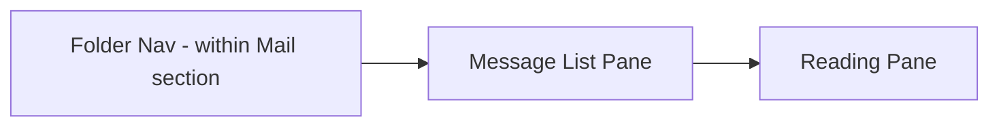

# 10 — Outlook-Style Mailbox (Inbox, Sent, Drafts, Outbox, Scheduled)

## 10.1 Mental Model

Unlike a traditional mailbox that receives external mail via IMAP/POP, PageJaunes Mailer's "mailbox" is a curated view over the `messages` and `drafts` tables representing the organization's own outbound activity, plus system-generated notices (bounces, replies routed via reply-to, if configured). This document covers the shared three-pane UI pattern and each folder's specific query/behavior.

## 10.2 Three-Pane Layout

- **Message List Pane**: virtualized list (for performance with large history), each row a `MessageListItem` (Fluent `Persona` for recipient + subject preview + status badge + timestamp).
- **Reading Pane**: shows full rendered HTML (sandboxed iframe), delivery timeline (status history from `message_events`), and recipient details (linking to the Recipient profile / Communication Timeline, see [16-email-history.md](16-email-history.md)).
- Selecting a row loads the reading pane via an Inertia partial reload (or client fetch) without a full page navigation, matching Outlook's snappy feel.

## 10.3 Folder Definitions

| Folder | Query | Notes |
|---|---|---|
| **Inbox** | System notices: bounce/complaint notifications, verification alerts, import completion notices surfaced as "messages" for a unified feel | Not third-party inbound mail; see [01-project-overview.md](01-project-overview.md#14-out-of-scope) |
| **Drafts** | `drafts` where `user_id = current` (or all drafts if Administrator, permission-gated) | Composer opens on click |
| **Outbox** | `messages` where `status in (queued, sending)` and not yet terminal | See [10.5](#105-outbox-detail) |
| **Scheduled** | `campaigns` where `send_mode in (scheduled, recurring)` and `status = scheduled`, plus individually scheduled transactional sends if supported | Shows countdown to next occurrence |
| **Sent Items** | `messages` where `status not in (queued, sending)` | Paginated, default sorted by `sent_at desc` |

## 10.4 List Behaviors (shared across folders)

- Multi-select via checkbox (Fluent `DataGrid` selection) enabling bulk actions: delete draft(s), cancel scheduled, move to a tag/list.
- Column customization (Sent Items/History specifically): toggle columns for Campaign, SMTP Account, Opens, Clicks.
- Filters: date range, status, campaign, tag — rendered as a Fluent `Drawer` filter panel, persisted per-user as query params (shareable/bookmarkable URLs).
- Search bar scoped to the current folder (subject/recipient/body full-text where feasible via Postgres `tsvector` on `messages.subject`/`html_body`).
- Sort: by date (default), status, recipient.

## 10.5 Outbox Detail

Outbox rows carry a **sub-status** distinguishing *why* a message hasn't sent yet, mapped from the Delivery Engine's decision (see [17-delivery-engine.md](17-delivery-engine.md) and [19-throttling.md](19-throttling.md)):

| Sub-status | Meaning |
|---|---|
| Pending | Queued, not yet picked up by a worker |
| Waiting for quota | An eligible SMTP account exists but its quota window is exhausted |
| Waiting for SMTP | No healthy SMTP account currently available (all disabled/unhealthy) |
| Delayed | Scheduled for a future business-hour window |
| Retrying | A previous attempt failed and a retry is scheduled (shows next attempt time) |

Row actions: **Cancel** (moves message to `failed` with reason `cancelled_by_user`, or removes if still purely queued and not yet attempted), **Retry now** (bypasses backoff delay, re-enters queue immediately — permission-gated), **Reschedule** (for campaign-level scheduled sends, opens the campaign's schedule editor), **Move to draft** (only valid for transactional messages not yet attempted; recreates a `Draft` from the message content and removes it from the send queue).

## 10.6 Scheduled Folder Detail

Shows both one-off scheduled campaigns and recurring campaign occurrences (`campaign_schedules`), each with next-occurrence time, recipient count estimate, and a "Review before sending" indicator if the campaign requires approval (see [15-campaign-management.md](15-campaign-management.md#154-review-before-sending)).

## 10.7 Empty States

Each folder has a tailored empty state (e.g. Drafts: "No drafts yet — start a new email", Outbox: "Nothing waiting to send").

## 10.8 Permissions

Folder contents are scoped per role: Marketing Operators see their own drafts/sent by default with an option (if permitted) to view team-wide; Administrators and Marketing Managers see organization-wide by default. Exact permission keys in [26-rbac.md](26-rbac.md).

Continue to [11-email-composer.md](11-email-composer.md).
