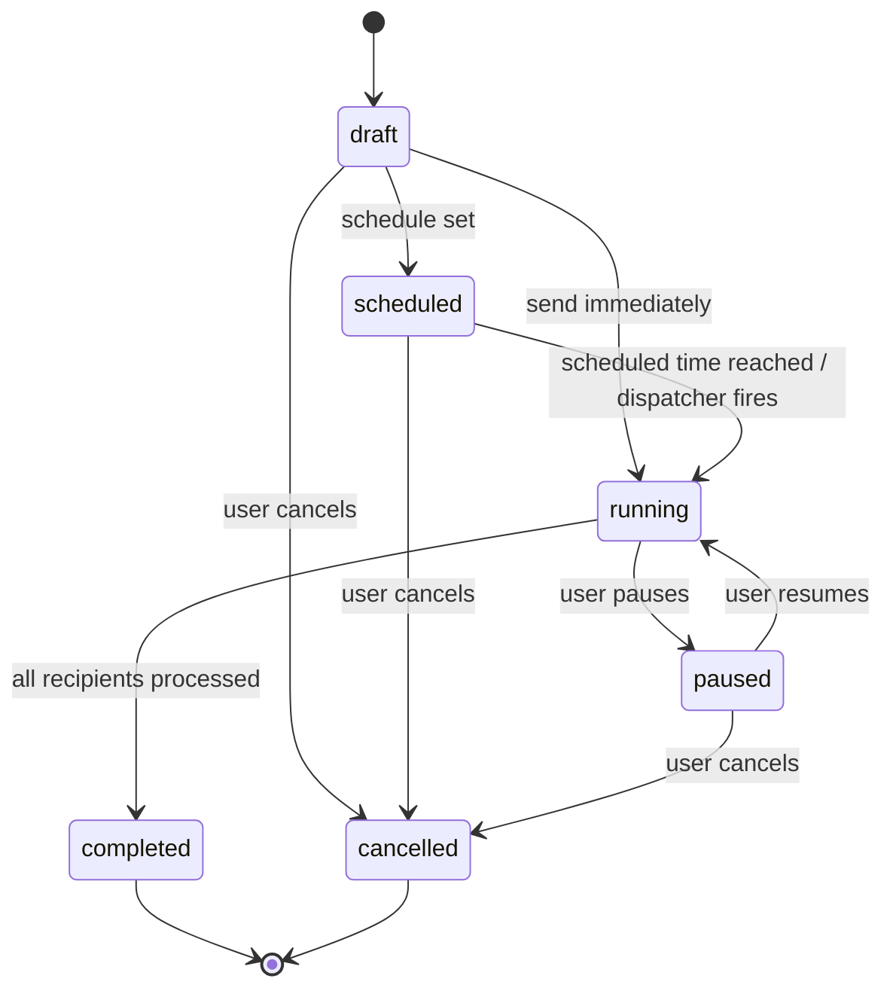

# 15 — Campaign Management

## 15.1 Campaign Lifecycle (State Machine)

Status values and columns fully defined in [04-database-design.md §4.8](04-database-design.md#48-campaigns-module). Transitions are enforced exclusively through `CampaignLifecycleService` (never direct model saves) so every transition can raise the corresponding domain event ([31-events.md](31-events.md)) and audit entry ([27-audit-logs.md](27-audit-logs.md)). `CampaignLifecycleService` itself is a thin caller of the shared `WorkflowEngine` ([37-workflow-engine.md](37-workflow-engine.md)) — this diagram **is** `CampaignWorkflow`'s definition.

## 15.2 Campaign Wizard

Multi-step creation flow (Fluent `TabList`/stepper):
1. **Basics** — name, template/blank selection (copies content per [12-template-system.md §12.6](12-template-system.md#126-usage-in-campaigns-drafts)).
2. **Content** — shared Composer editor (rich text/blocks/HTML, merge variables, preview modes) per [11-email-composer.md](11-email-composer.md).
3. **Recipients** — select an existing Recipient List or Segment ([13-recipient-management.md](13-recipient-management.md)); live audience size estimate shown.
4. **Sending Configuration** — SMTP strategy (`auto_rotate` vs pin to a `single_smtp_account_id`), send mode (immediate/scheduled/recurring), business-hours constraints.
5. **Review** — full preview + recipient count + estimated send duration (derived from active SMTP accounts' aggregate throughput, see [19-throttling.md](19-throttling.md)) + optional approval step (15.4) + the deliverability scorecard from [39-deliverability-analyzer.md](39-deliverability-analyzer.md) (SPF/DKIM/DMARC, unsubscribe link presence, broken links, spam heuristics), which can be configured to block progression on failing checks.

## 15.3 Scheduling & Recurrence

- **Immediate**: dispatch begins as soon as the campaign is confirmed sent.
- **Scheduled**: single future `scheduled_at`; a scheduler tick (every minute, see [02-system-architecture.md §2.9](02-system-architecture.md#29-scheduling-strategy)) picks up due campaigns.
- **Recurring**: `recurrence_rule` (RFC 5545 RRULE, e.g. `FREQ=WEEKLY;BYDAY=MO`) expanded into upcoming `campaign_schedules` occurrences (rolling window, e.g. next 90 days materialized, extended periodically by a job). Each occurrence dispatches independently, producing its own `campaign_recipients`/`messages` snapshot — the parent `campaigns` row's `status` reflects the *series* (`scheduled` while occurrences remain), while each `campaign_schedules` row tracks its own dispatch state.
- **Business-hour sending**: if `business_hours_only`, the dispatcher (and the throttling engine, see [19-throttling.md](19-throttling.md)) only releases messages within `business_hours_start`–`business_hours_end` on days listed in `business_days`; messages otherwise ready are held (Outbox sub-status "Delayed").

## 15.4 Review Before Sending

Optional per-campaign or organization-wide-default (Settings) gate: a campaign in `draft` cannot transition to `scheduled`/`running` until `approved_by` is set by a user holding the `campaigns.approve` permission (typically Marketing Manager/Administrator; see [26-rbac.md](26-rbac.md)). The Review step in the wizard becomes an explicit "Submit for approval" action when this policy is on, and the campaign sits in `draft` with a visible "Pending approval" flag until approved.

## 15.5 Send Immediately vs. Review Flow

If review-before-sending is disabled, "Send Now" is a single confirmed action (with a modal recipient-count confirmation to prevent accidental large sends) that transitions `draft → running` and immediately dispatches.

## 15.6 Pause / Resume / Cancel

- **Pause**: stops new message dispatch from the queue for this campaign (already-queued/in-flight jobs already picked up by a worker complete normally; the dispatcher checks campaign status before releasing the *next* batch). Implemented via a status check gate in `SendCampaignMessageJob` and by not enqueuing further batches while paused.
- **Resume**: re-enables dispatch from where it left off (unsent `campaign_recipients` rows, i.e. those without a linked `message_id`, are the resumption set).
- **Cancel**: any unsent `campaign_recipients` are marked as not-to-be-sent (their prospective `messages` rows, if pre-created, are set to `failed`/`cancelled` state); already-sent messages are untouched (cancellation never un-sends).

## 15.7 Campaign Cloning

"Clone" copies `name` (suffixed "Copy of…"), `template_id`/`html_body`/`subject`, `recipient_list_id`, and sending configuration into a new `draft`-status campaign with `cloned_from_campaign_id` set; scheduling fields are reset (never copy a stale `scheduled_at`).

## 15.8 Campaign Detail Tabs

| Tab | Content |
|---|---|
| Overview | Status, schedule, audience size, quick stats |
| Recipients | `campaign_recipients` grid with per-recipient `message` status |
| Content | Read-only rendered preview of the snapshot `html_body` (edits only allowed while `draft`) |
| Analytics | Delivery funnel, opens/clicks, bounce/complaint breakdown — see [25-reporting.md](25-reporting.md) |

## 15.9 Permissions

Create/edit/send/cancel gated per [26-rbac.md](26-rbac.md); Viewers have Analytics-tab read access only.

Continue to [16-email-history.md](16-email-history.md).
