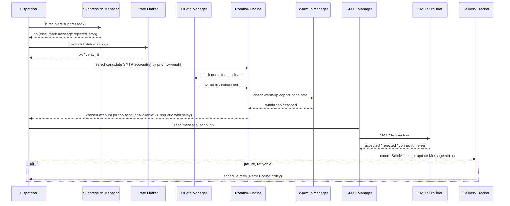

# 17 — Email Delivery Engine

## 17.1 Purpose

The Delivery Engine is the set of collaborating services responsible for taking a "ready to send" message and getting it safely, compliantly, and observably out through one of many configured SMTP accounts — without ever exceeding a provider's stated limits. It is the most critical subsystem in the platform; every other module (Composer, Campaigns) merely *produces* messages, while this module *delivers* them.

## 17.2 Service Decomposition

| Service | Responsibility | Detail Doc |
|---|---|---|
| **Queue Dispatcher** | Chunked enqueueing of `SendEmailJob`s from a campaign/transactional send; paces enqueue rate so Redis queues don't balloon instantly for huge campaigns | §17.4, [24-queue-management.md](24-queue-management.md) |
| **Rate Limiter** | Enforces minute/hour/day and per-domain send-rate ceilings at job-execution time | [19-throttling.md](19-throttling.md) |
| **Quota Manager** | Tracks and reserves quota consumption per SMTP account per time window | [19-throttling.md](19-throttling.md) |
| **Rotation Engine** | Chooses which healthy, in-quota SMTP account handles a given send, honoring priority/weight | §17.5 |
| **Warm-up Manager** | Caps volume for accounts in warm-up according to `warmup_schedules` | [19-throttling.md](19-throttling.md) |
| **SMTP Manager** | Owns actual SMTP transport (connection reuse up to `max_messages_per_connection`, concurrency limits), executes the send | §17.6, [18-smtp-management.md](18-smtp-management.md) |
| **Retry Engine** | Decides whether/when to retry a failed attempt | §17.7 |
| **Failover Engine** | On a retryable failure tied to the SMTP account itself (not the message), re-routes to a different account | §17.8 |
| **Delivery Tracker** | Records status transitions from send through webhook-driven terminal states | [20-delivery-tracking.md](20-delivery-tracking.md) |
| **Bounce Processor / Complaint Processor** | Interpret webhook/bounce payloads into `message_events` + status updates | [23-suppression-list.md](23-suppression-list.md) |
| **Suppression Manager** | Central gate consulted before every send attempt | [23-suppression-list.md](23-suppression-list.md) |
| **Webhook Receiver** | Ingests provider delivery events (delivered/bounced/complained/opened/clicked where provider-native) | §17.9, [20-delivery-tracking.md](20-delivery-tracking.md) |

## 17.3 End-to-End Send Sequence

## 17.4 Queue Dispatcher

For a campaign with N recipients, the Dispatcher does **not** enqueue N jobs instantaneously; it enqueues in chunks (configurable chunk size, default 500) via a recursive/self-scheduling job (`DispatchCampaignJob` re-enqueues itself for the next chunk) so that: (a) Redis memory stays bounded for very large campaigns, (b) a paused/cancelled campaign stops producing new chunks promptly, (c) per-chunk enqueue can re-check current quota/health state rather than committing to a stale plan. Each individual message becomes a `SendEmailJob` carrying `message_id` only (not the full payload) to keep queue payloads small.

## 17.5 Rotation Engine — Selection Algorithm

1. Filter `smtp_accounts` to `is_active = true` and `health_status in (healthy, degraded)` (unhealthy/disabled excluded entirely).
2. If the campaign pins `single_smtp_account_id`, that account is the only candidate (still subject to quota — if exhausted, message waits, no fallback rotation, since pinning is an explicit user choice).
3. Otherwise (`auto_rotate`), candidates are ordered by `priority` ascending (lower number = higher priority), then filtered to those with available quota per Quota Manager and within warm-up cap per Warm-up Manager.
4. Among equally-prioritized eligible candidates, distribute using **weighted round-robin** keyed by `rotation_weight` (an account with weight 3 receives 3x the share of an account with weight 1), state kept in Redis (a rolling counter per priority tier).
5. If zero candidates are eligible, the message remains queued in "Waiting for SMTP" / "Waiting for quota" sub-status (see [10-mailbox.md §10.5](10-mailbox.md#105-outbox-detail)) and the job is released back to the queue with a computed delay (until the nearest quota window reset or a health re-check interval).

## 17.6 SMTP Manager

Wraps Laravel's mailer transport per SMTP account (each `smtp_account` maps to a dynamically-configured mail "mailer" at runtime, not static `config/mail.php` entries, since accounts are user-managed data). Enforces `max_concurrent_connections` via a Redis semaphore per account, and `max_messages_per_connection` by tracking messages-sent-on-current-connection and forcing reconnect when the cap is reached. All send attempts are recorded to `send_attempts` regardless of outcome.

## 17.7 Retry Engine

Configurable exponential backoff policy (per [04-database-design.md] no dedicated retry-policy table is required — policy is Settings-driven global config with optional per-SMTP-account override stored as `smtp_accounts`-adjacent settings key, e.g. `retry_policy.{account_uuid}`): base delay (default 60s), multiplier (default 2), max retries (default 5), max delay cap (default 1 hour). Distinguishes:

- **Message-level transient failure** (e.g. recipient mailbox temporarily full → soft bounce): retry the *same or rotated* account after backoff.
- **Permanent failure** (hard bounce, invalid recipient, provider says "do not retry"): no retry; immediately routes to Suppression Manager and Bounce Processor, final status `hard_bounced`/`failed`.
- **Account-level connectivity failure** (auth error, connection refused): triggers Failover Engine rather than a plain retry of the same account.

Full policy detail in [19-throttling.md §19.7](19-throttling.md#197-retry-policies).

## 17.8 Failover Engine

When `send_attempts` shows an account-level failure (not message-content-related), the Failover Engine marks that account `health_status = degraded` (or `unhealthy` after N consecutive failures within a window) and immediately re-selects via the Rotation Engine excluding the failed account for this message's next attempt — bounded by overall `Retry Engine` max-retries so a message can't loop indefinitely across accounts.

## 17.9 Webhook Receiver

A single authenticated HTTP endpoint per configured provider type (signature/HMAC-verified per provider's scheme) normalizes inbound provider payloads into a common internal event shape before handing off to the Delivery Tracker / Bounce Processor / Complaint Processor. See [20-delivery-tracking.md](20-delivery-tracking.md) and [29-api-specification.md](29-api-specification.md) for endpoint contracts.

## 17.10 Idempotency & Safety

- `SendEmailJob` is idempotent: it checks `messages.status` before sending and no-ops if already in a terminal or in-flight state (guards against duplicate queue delivery, a normal at-least-once queue semantics scenario).
- Suppression check happens both at campaign dispatch time (bulk pre-filter) **and** again at individual job execution time (defense in depth against a recipient being suppressed between dispatch and execution, e.g. a complaint arriving mid-campaign).

Continue to [18-smtp-management.md](18-smtp-management.md).
