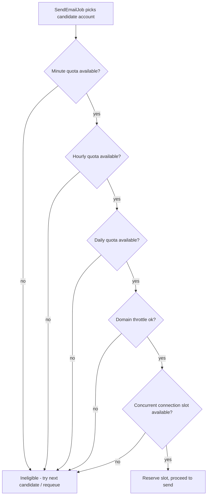

# 19 — SMTP Throttling

## 19.1 Guiding Rule

The system must **never** exceed a configured SMTP account's declared thresholds. All limits are per-account, admin-configured data (`smtp_accounts` columns, see [04-database-design.md §4.9](04-database-design.md#49-delivery-engine-module)) — no limit is ever hardcoded per provider name in application code (see [18-smtp-management.md §18.3](18-smtp-management.md#183-provider-defaults-configurable-not-hardcoded)).

## 19.2 Enforcement Architecture

Real-time enforcement uses **Redis atomic counters with sliding/fixed windows** for low-latency check-and-increment at job-execution time; `quota_ledger` (Postgres) is the durable, reconciled record used for reporting/dashboards and as a recovery source if Redis data is lost (a scheduled reconciliation job cross-checks Redis counts against `messages` sent per window and corrects drift).

| Limit Type | Enforcement Mechanism |
|---|---|
| Daily / Hourly / Minute quota | Redis key `smtp:{account_id}:quota:{window}:{window_start}` incremented atomically (`INCR` + `EXPIRE`) before each send attempt is allowed to proceed; if `count >= limit`, account is ineligible for this window |
| Per-domain throttling | Redis key `smtp:{account_id}:domain:{domain}:{minute_bucket}` — caps sends to the same recipient domain (e.g. max 10/minute to `gmail.com`) to avoid provider-side domain-level throttling/greylisting, threshold configurable in Settings globally with optional per-account override |
| Concurrent connections | Redis semaphore (`INCR`/`DECR` around the SMTP transaction) capped at `max_concurrent_connections` |
| Max messages per connection | In-process counter within the persistent connection held by a given worker, forcing reconnect at the cap |
| Warm-up daily cap | Same daily-quota mechanism but the effective limit for the day is read from `warmup_schedules.stages[currentDay].max_per_day` instead of `smtp_accounts.daily_quota` (the lower of the two applies) |

## 19.3 Quota Check Flow

Reservation is atomic (Redis `INCR` happens before the send attempt, not after) to prevent race conditions between concurrent workers; if the send ultimately fails for a reason unrelated to quota (e.g. connection error), the reservation is **not** rolled back for daily/hourly/minute quota (a failed attempt still consumed a real connection/slot in most provider accounting) but **is** rolled back for the connection-concurrency semaphore (that slot is genuinely free again).

## 19.4 Random Delays

To avoid bursty, bot-like sending patterns (especially for campaigns), the Dispatcher can inject a randomized micro-delay between individual sends within a chunk (configurable range, e.g. 200–800ms, Settings-driven, can be disabled). This is implemented as a delayed queue release (`available_at` on the job) rather than a blocking sleep, so worker throughput isn't wasted.

## 19.5 Automatic Pause & Resume

- **Automatic pause** triggers when: an account's bounce/complaint rate crosses the "unhealthy" threshold ([18-smtp-management.md §18.5](18-smtp-management.md#185-health-monitoring)), or a provider explicitly signals a hard rate-limit/suspension response (detected via provider error code pattern matching, configurable per provider in Settings). The account is set `is_active` remains true but `health_status = unhealthy`, which the Rotation Engine treats as ineligible — functionally paused without requiring a destructive deactivation.
- **Automatic resume**: a scheduled health probe re-evaluates the account; if metrics recover below threshold for a sustained period (configurable cool-down, default 1 hour), `health_status` returns to `degraded` then `healthy` as evidence accumulates (never an instant jump back to fully healthy, to avoid flapping).

## 19.6 Warm-up Schedules

`warmup_schedules.stages` is an ordered array `[{day:1, max_per_day:50}, {day:2, max_per_day:100}, ...]`. `smtp_accounts.warmup_enabled=true` combined with a linked schedule means "day" is computed as `floor(now - account.created_at in days) + 1`, clamped to the last defined stage once the schedule is exhausted (after which normal `daily_quota` applies). A dashboard widget shows current warm-up day/cap per account (see [09-dashboard.md](09-dashboard.md)).

## 19.7 Retry Policies

Configurable (Settings, global default + optional per-account override):

| Setting | Default |
|---|---|
| Base retry delay | 60 seconds |
| Backoff multiplier | 2x |
| Max retry delay cap | 3600 seconds |
| Max retry attempts | 5 |
| Permanent-failure detection | Provider response code/keyword matching (configurable regex/list in Settings, e.g. SMTP 5xx codes, "mailbox does not exist", "user unknown") classified as permanent — no further retries, routes to suppression |

Retry reasons are recorded per attempt in `send_attempts.error_code`/`provider_response` for diagnosis; the Outbox UI surfaces the next retry time and reason (see [10-mailbox.md §10.5](10-mailbox.md#105-outbox-detail)).

## 19.8 Dynamic Scheduling

When a campaign's estimated audience exceeds what active accounts can send within a desired window, the system computes an estimated completion time (sum of effective per-window capacity across eligible accounts, accounting for warm-up caps and business-hours constraints) and surfaces it in the Campaign Wizard's Review step ([15-campaign-management.md §15.2](15-campaign-management.md#152-campaign-wizard)) rather than silently queuing more than can be delivered in the expected timeframe — this is advisory, not a hard block, since queuing is always safe (messages simply wait longer).

## 19.9 Quota Monitoring

Real-time quota usage (Redis counters) surfaced via the SMTP account detail page ([18-smtp-management.md §18.6](18-smtp-management.md#186-smtp-accounts-list-view)) and Dashboard SMTP widget, refreshed via short-interval polling (30s). Historical quota usage (for trend reporting) comes from the durable `quota_ledger` table.

Continue to [20-delivery-tracking.md](20-delivery-tracking.md).
