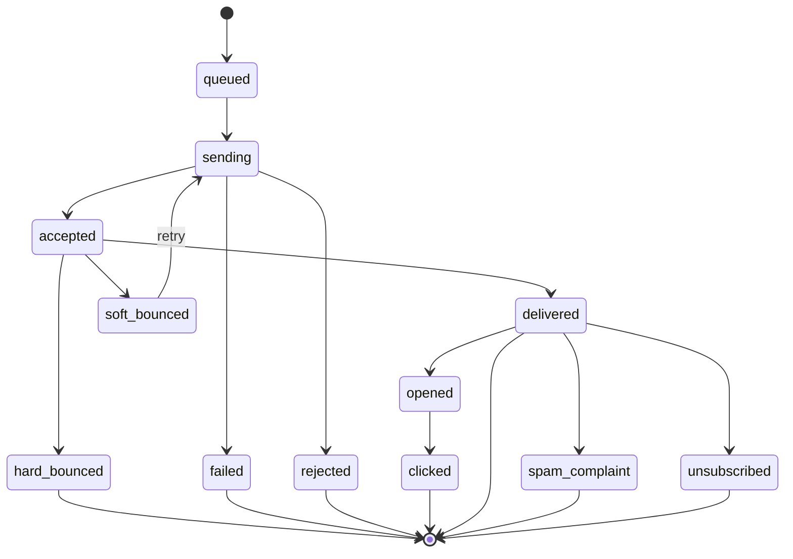

# 20 — Delivery Tracking

## 20.1 Status Lifecycle

`messages.status` (see [04-database-design.md §4.10](04-database-design.md#410-tracking-module)) progresses through a well-defined set of states, each also appended as a `message_events` row for full audit history (multiple `opened`/`clicked` events can occur after the terminal-ish `delivered` state; `messages.status` reflects the *most advanced* state reached while `open_count`/`click_count` track repeats). The linear backbone below is governed by the shared `WorkflowEngine` as `MessageWorkflow` ([37-workflow-engine.md §37.4](37-workflow-engine.md#374-what-explicitly-does-not-move-to-the-workflow-engine)); the repeatable, non-linear `opened`/`clicked` events remain in the append-only `message_events` log rather than the workflow itself.

| Status | Trigger |
|---|---|
| `queued` | Message row created, job dispatched |
| `sending` | Worker picked up job, SMTP transaction in progress |
| `accepted` | Provider accepted the message for delivery (SMTP 250 or provider API 2xx) |
| `delivered` | Provider webhook confirms delivery to recipient mailbox (if provider supports delivery webhooks; otherwise `accepted` is treated as the practical terminal success state, configurable per provider capability) |
| `opened` | Tracking pixel loaded (see [21-open-click-tracking.md](21-open-click-tracking.md)) |
| `clicked` | Tracked link followed |
| `soft_bounced` | Transient provider rejection (mailbox full, greylisting) — eligible for retry per [19-throttling.md §19.7](19-throttling.md#197-retry-policies) |
| `hard_bounced` | Permanent provider rejection (invalid address, domain doesn't exist) — triggers suppression |
| `failed` | Non-provider failure (connection error exhausted retries, cancelled) |
| `rejected` | Blocked pre-send (suppression list hit, verification failed hard) |
| `spam_complaint` | Recipient/mailbox provider reported as spam (feedback loop webhook) — triggers suppression |
| `unsubscribed` | Recipient used unsubscribe link/header |

## 20.2 Data Captured Per Event

`message_events.metadata` (jsonb) captures context appropriate to the event type: IP address + user-agent for opens/clicks, raw provider payload for webhook-driven events, `error_code`/reason for bounces/failures, `link_id` (FK-like reference to `click_links.id`) for click events.

## 20.3 Timestamps

Dedicated nullable timestamp columns on `messages` (`queued_at`, `sent_at`, `delivered_at`, `opened_at`, `clicked_at`, `bounced_at`, `failed_at`) record the **first** time each milestone was reached, for fast querying/reporting without scanning `message_events`; the full repeated history (e.g. every open) lives only in `message_events`.

## 20.4 Provider Response Storage

Every terminal or notable transition stores the raw provider response text (`messages.last_provider_response`, and per-attempt in `send_attempts.provider_response`) to support diagnosis without needing to re-contact the provider.

## 20.5 Consumers of Tracking Data

- **Mailbox/Email History** ([10-mailbox.md](10-mailbox.md), [16-email-history.md](16-email-history.md)) — status badges, message detail timeline.
- **Reporting** ([25-reporting.md](25-reporting.md)) — funnel/rate calculations from `messages`/materialized views.
- **Suppression Manager** ([23-suppression-list.md](23-suppression-list.md)) — listens for `hard_bounced`/`spam_complaint`/`unsubscribed` events.
- **SMTP Health Monitoring** ([18-smtp-management.md §18.5](18-smtp-management.md#185-health-monitoring)) — bounce/complaint rate inputs.

Continue to [21-open-click-tracking.md](21-open-click-tracking.md).
