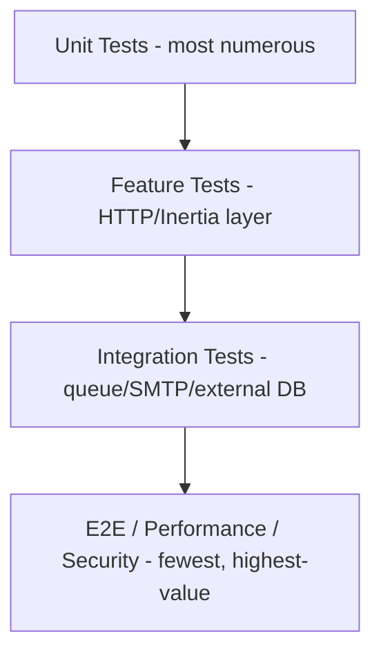

# 32 — Testing Strategy

## 32.1 Test Pyramid

## 32.2 Unit Tests

Scope: Domain Services in isolation (mocked repositories/dependencies) — `RotationEngine` selection logic, `QuotaManager` window math, `SegmentEvaluationService` rule-tree-to-query translation, `RetryEngine` backoff calculation, merge-variable resolution. Target: fast (<100ms/test), no DB/Redis I/O where feasible (use in-memory fakes for Redis counter logic).

## 32.3 Feature Tests

Scope: full HTTP request → controller → service → DB round trip using Laravel's testing DB (transactional rollback per test). Covers every endpoint in [29-api-specification.md](29-api-specification.md): authorization (403 for wrong role per [26-rbac.md](26-rbac.md) matrix — a dedicated parametrized test suite iterates the full permission matrix against key endpoints), validation (422 cases), state-machine guards (409 cases, e.g. sending an already-sent campaign), and correct response shape/pagination.

## 32.4 Integration Tests

- **Queue testing**: `Queue::fake()`/`Bus::fake()` to assert correct jobs are dispatched with correct payloads (e.g. campaign send dispatches `DispatchCampaignJob` with correct chunk size); a smaller set of tests run against a real Redis-backed queue in CI (using `sync` driver substitution is insufficient for verifying actual queue behavior like delays/uniqueness, so a dedicated CI job runs `queue:work` against a test Redis instance for these).
- **SMTP testing**: a fake SMTP transport (Laravel's `Mail::fake()` equivalent extended with a custom fake transport that can simulate provider accept/reject/bounce responses) validates the full Delivery Engine flow (rotation, quota decrement, retry, failover) without hitting real providers. A smaller, manually-triggered suite validates against a real sandbox SMTP provider (e.g. Mailtrap-style test inbox) before releases.
- **External PageJaunes DB integration**: tested against a disposable Postgres instance seeded with a representative fixture schema/data mirroring the expected external shape (see [06-pagejaunes-integration.md](06-pagejaunes-integration.md)), verifying the repository's read-only boundary (a test asserts no write-capable SQL is ever issued on that connection) and circuit-breaker behavior (simulated connection failure).
- **Webhook integration**: signature verification tests per configured provider, including intentionally-invalid-signature rejection tests (28.8).

## 32.5 Performance Testing

- Load test the `SendEmailJob` pipeline (rotation/quota/rate-limiter) to validate the throughput targets in [02-system-architecture.md §2.12](02-system-architecture.md#212-non-functional-requirements) (≥50,000 messages/day aggregate) using a fake SMTP transport with realistic latency simulation.
- Query performance benchmarks on `messages`/`message_events` at realistic scale (millions of rows) to validate index choices in [04-database-design.md](04-database-design.md), particularly for Email History filtering and Reporting materialized view refresh time.
- Segment evaluation performance benchmarked against large `recipients` tables to ensure the 15-minute cache TTL is sufficient headroom.

## 32.6 Security Testing

- Automated dependency vulnerability scanning in CI (Composer audit / npm audit) on every PR.
- Authorization matrix tests (32.3) double as a security regression suite — any accidental permission-check removal fails CI.
- Manual/periodic penetration-test-style review against the OWASP mapping in [28-security.md §28.10](28-security.md#2810-owasp-top-10-mapping), particularly the sandboxed HTML rendering (28.4) and webhook signature verification (28.8).
- CSRF/session tests: verify state-changing endpoints reject requests without a valid token.

## 32.7 Test Data & Factories

Model factories for every entity in [04-database-design.md](04-database-design.md), with realistic states (e.g. an `SmtpAccount` factory state `->warmingUp()`, a `Campaign` factory state `->running()->withRecipients(500)`) to make Feature/Integration test setup expressive and DRY.

## 32.8 CI Gates

Every PR: lint (PHP-CS-Fixer/Pint, ESLint/Prettier) → static analysis (PHPStan/Larastan, TypeScript strict mode) → unit → feature → a curated integration subset (fast Redis-backed queue tests) must pass before merge. Full performance/security suites run on a scheduled (nightly) basis rather than per-PR, given their longer runtime.

Continue to [33-deployment.md](33-deployment.md).
