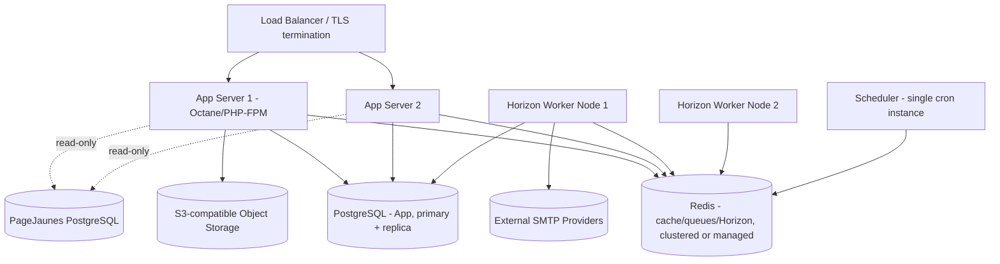

# 33 — Deployment

## 33.1 Environments

| Environment | Purpose | Notes |
|---|---|---|
| **Development** | Local developer machines | Docker Compose stack (33.3), seeded fixture data, fake SMTP transport by default, PageJaunes connection points at a local fixture DB |
| **Staging** | Pre-production validation | Mirrors production topology at smaller scale; real (sandboxed) SMTP provider accounts with tiny quotas; read-only connection to a staging/replica PageJaunes DB if available, else fixture DB |
| **Production** | Live organization use | Full topology per 33.2, real SMTP providers, real PageJaunes DB connection |

## 33.2 Production Topology

Web tier is stateless (sessions in Redis/DB, not local files) so it scales horizontally behind the load balancer; the Scheduler runs on exactly one node (or via a leader-election/locking mechanism, e.g. `withoutOverlapping()` + a shared cache lock) to avoid duplicate scheduled dispatches.

## 33.3 Docker

- `docker-compose.yml` for development: `app` (PHP-FPM + Nginx or Octane), `postgres` (app DB), `postgres-pagejaunes-fixture` (local stand-in for the external DB), `redis`, `mailhog`-style fake SMTP catcher, `node` (Vite dev server for HMR).
- Production images built via multi-stage Dockerfile (composer install → npm build → slim runtime image), no dev dependencies/tools in the runtime image, non-root container user.

## 33.4 Environment Variables (key groups)

| Group | Variables |
|---|---|
| App | `APP_KEY`, `APP_URL`, `APP_ENV`, `APP_DEBUG` (always `false` outside development) |
| App DB | `DB_HOST`, `DB_PORT`, `DB_DATABASE`, `DB_USERNAME`, `DB_PASSWORD` |
| PageJaunes DB | `PAGEJAUNES_DB_HOST`, `PAGEJAUNES_DB_PORT`, `PAGEJAUNES_DB_DATABASE`, `PAGEJAUNES_DB_USERNAME` (read-only role), `PAGEJAUNES_DB_PASSWORD`, `PAGEJAUNES_DB_SSLMODE` |
| Redis | `REDIS_HOST`, `REDIS_PORT`, `REDIS_PASSWORD`, separate logical DB indices for cache vs. queue vs. Horizon |
| Storage | `FILESYSTEM_DISK`, `AWS_*` (or equivalent S3-compatible credentials) |
| Mail/Tracking | `MAILER_TRACKING_DOMAIN` |
| Verification Provider | `EMAIL_VERIFICATION_PROVIDER`, `EMAIL_VERIFICATION_API_KEY` |

All secrets sourced from a secrets manager (cloud provider's native secrets store or Vault) in staging/production, injected as environment variables at container start — never baked into images, never committed.

## 33.5 Backups

- App PostgreSQL: automated daily full backup + continuous WAL archiving for point-in-time recovery (retention: 30 days rolling, configurable per organizational policy).
- Redis: primarily cache/queue (transient) — persistence (AOF/RDB) enabled for Horizon/queue durability but not treated as a backup source of truth; durable state always has a Postgres counterpart (`quota_ledger` reconciles Redis counters, per [19-throttling.md §19.2](19-throttling.md#192-enforcement-architecture)).
- Object storage (attachments, exports): versioning enabled on the bucket; lifecycle policy matches the app-level retention documented in [02-system-architecture.md §2.8](02-system-architecture.md#28-storage-strategy).
- **No backup/write access is ever taken of the external PageJaunes database** — it is entirely out of this application's operational responsibility.

## 33.6 Logging & Monitoring

- Application logs: structured JSON logs shipped to a centralized log aggregator (e.g. CloudWatch/ELK/Datadog — infrastructure-agnostic requirement, specific tool chosen at implementation time).
- Horizon dashboard + in-app Queue Monitoring ([24-queue-management.md](24-queue-management.md)) for queue health.
- Application Performance Monitoring (APM) instrumentation on the web tier (request latency, error rate) and worker tier (job duration, failure rate) feeding alerting thresholds (e.g. page an on-call if queue backlog exceeds N for M minutes, or SMTP account health degrades — mirrors the internal Notification triggers in [02-system-architecture.md §2.11](02-system-architecture.md#211-notifications), surfaced additionally to ops tooling).
- Database slow-query logging enabled with a threshold tuned to the p95 targets in [02-system-architecture.md §2.12](02-system-architecture.md#212-non-functional-requirements).

## 33.7 Scaling Strategy

| Dimension | Approach |
|---|---|
| Web tier | Horizontal autoscaling behind load balancer, stateless |
| Queue workers | Horizon `balance: auto` per queue; scale worker node count based on queue depth metrics |
| Database | Vertical scaling first (single-org workload), read replica for reporting queries if the primary shows contention, partitioning of `messages`/`message_events` by month if volume warrants (roadmap consideration, [34-roadmap.md](34-roadmap.md)) |
| Redis | Managed clustered Redis if queue/cache volume outgrows a single node |

## 33.8 Release Process

Standard zero/low-downtime deploy: build → run migrations (`migrate --force`, backward-compatible migrations preferred — additive columns before removing old ones in a follow-up release) → deploy new app code behind the load balancer with health-check-gated rollout → restart Horizon workers gracefully (`horizon:terminate`, supervisor restarts them onto new code, in-flight jobs complete on old code first per Horizon's graceful termination).

Continue to [34-roadmap.md](34-roadmap.md).
