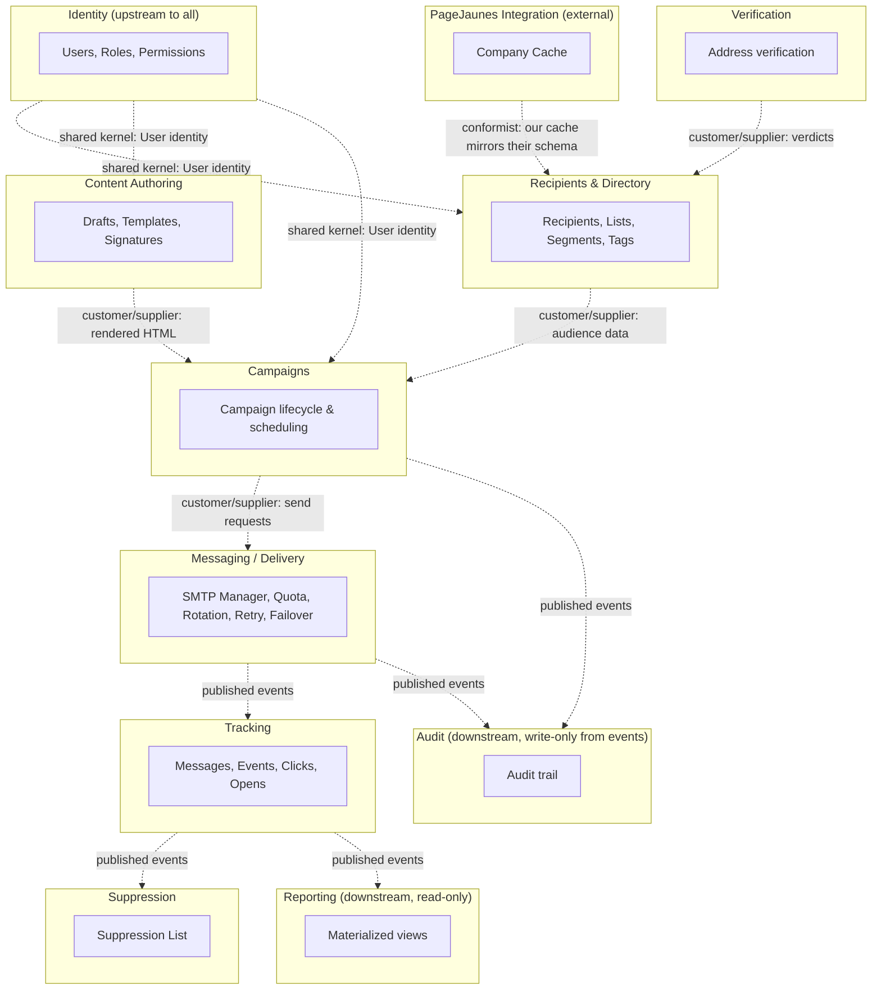

# 35 — Domain-Driven Design: Bounded Contexts

## 35.1 Purpose

[02-system-architecture.md §2.3](02-system-architecture.md#23-module-bounded-context-decomposition) already decomposes the system into modules mapped 1:1 to Laravel namespaces. This document makes the **domain-driven design boundaries explicit and formal**: which modules form a single bounded context, what each context's ubiquitous language is, where the authoritative model of a concept lives, and how contexts integrate when they need each other's data. This is a refinement of 02.3, not a replacement — the module list and namespace mapping there still stands; here we name the *contracts between* those modules.

## 35.2 Bounded Context Map

## 35.3 Context Catalog

| Bounded Context | Modules ([02-system-architecture.md §2.3](02-system-architecture.md#23-module-bounded-context-decomposition)) | Ubiquitous Language | Owns the Authoritative Model Of |
|---|---|---|---|
| **Identity** | `Identity` | User, Role, Permission, Session | `users`, `roles`, `permissions` |
| **Recipients & Directory** | `Recipients`, `Importing` | Recipient, List, Segment, Tag, Source | `recipients`, `recipient_lists`, `segments`, `tags` |
| **PageJaunes Integration** | `PageJaunesIntegration` | Company, Wilaya, Locality — terms borrowed verbatim from the external system (see [06-pagejaunes-integration.md](06-pagejaunes-integration.md)) | `pagejaunes_company_cache`, `pagejaunes_company_emails_cache` |
| **Content Authoring** | `Composer`, `Templates` | Draft, Template, Block, Signature, Version | `drafts`, `templates`, `template_blocks`, `signatures` |
| **Campaigns** | `Campaigns` | Campaign, Occurrence, Audience, Approval | `campaigns`, `campaign_schedules`, `campaign_recipients` |
| **Messaging / Delivery** | `DeliveryEngine` | SmtpAccount, Quota, Rotation, Warm-up, Attempt | `smtp_accounts`, `quota_ledger`, `send_attempts`, `warmup_schedules` |
| **Tracking** | `Tracking` | Message, Event, Open, Click | `messages`, `message_events`, `click_links` |
| **Verification** | `Verification` | Verdict, Check | `verification_results` |
| **Suppression** | `Suppression` | Suppression Entry, Reason | `suppression_entries` |
| **Reporting** | `Reporting` | Snapshot, Funnel, Rate | materialized views (read-only projection, owns no writable model) |
| **Audit** | `Audit` | Audit Event | `audit_logs` (write-only from listeners, never business logic) |
| **Settings** | `Settings` | Setting | `settings` |

## 35.4 Relationship Patterns (DDD Integration Types)

| Pattern | Where It Applies | Meaning |
|---|---|---|
| **Shared Kernel** | Identity → every other context | `User`/`Role`/permission checks are a shared, tightly-coupled kernel every context depends on directly (not via events) — this is deliberate, since RBAC must be consistently enforced everywhere ([26-rbac.md](26-rbac.md)). |
| **Conformist** | PageJaunes Integration → Recipients | We conform to the external system's data shape (field names, one-to-many email relationship) rather than translating it into our own ideal model, since we don't own or influence that schema ([06-pagejaunes-integration.md §6.3](06-pagejaunes-integration.md#63-source--cache-field-mapping)). |
| **Customer/Supplier** | Recipients → Campaigns, Content → Campaigns, Campaigns → Messaging | Downstream context (customer) depends on upstream (supplier) providing a stable contract (resolved audience snapshot, rendered HTML snapshot) — this is exactly why `campaigns.html_body` and `campaign_recipients` are **snapshots**, not live references ([04-database-design.md §4.8](04-database-design.md#48-campaigns-module)): it makes the supplier relationship explicit and freezes the contract at hand-off time rather than leaving Campaigns coupled to a mutable upstream. |
| **Published Language / Event-Driven** | Messaging → Tracking → Suppression/Reporting/Audit | Contexts never call into each other synchronously for these flows; they communicate exclusively through Domain Events with a stable payload shape ([31-events.md](31-events.md)) — the event catalog **is** the published language. |
| **Open Host Service** | Messaging (SMTP/Verification provider adapters) | The provider-agnostic adapter interfaces ([18-smtp-management.md §18.3](18-smtp-management.md#183-provider-defaults-configurable-not-hardcoded), [22-email-verification.md §22.3](22-email-verification.md#223-provider-abstraction)) are Open Host Services: a stable interface any external provider implementation can plug into, rather than context-specific coupling to one vendor's API shape. |
| **Anticorruption Layer** | `PageJaunesCompanyRepository` | The repository is the ACL: it is the only place external MySQL row shapes are translated into our own `PageJaunesCompanyDto` — no other context ever sees raw source column names ([06-pagejaunes-integration.md §6.4](06-pagejaunes-integration.md#64-repository-layer)). |

## 35.5 Ownership Rule

**No context reaches into another context's tables directly.** Cross-context reads go through the owning context's Repository/Service (e.g. Campaigns asks Recipients' `SegmentEvaluationService` to resolve an audience; it never queries `recipients` directly). This is already implicit in the module structure of [03-folder-structure.md](03-folder-structure.md) — this document makes it an explicit, enforceable architectural rule, useful as a static-analysis/code-review checklist item ("does this module import an Eloquent model from a different module's `Models/` namespace? If so, that's a boundary violation — go through the owning module's service instead").

## 35.6 Why This Wasn't a Separate Module List

The bounded contexts above are a **relationship overlay** on the existing module decomposition in [02-system-architecture.md §2.3](02-system-architecture.md#23-module-bounded-context-decomposition), not a new set of folders — e.g., "Content Authoring" groups the `Composer` and `Templates` modules because they share a ubiquitous language and are usually changed together, but they remain separate Laravel modules/namespaces for granularity. Treat this document as the answer to "which modules are allowed to be tightly coupled to each other, and which must only integrate through events/services" when a new feature's placement is ambiguous.

Continue to [36-c4-architecture.md](36-c4-architecture.md).
