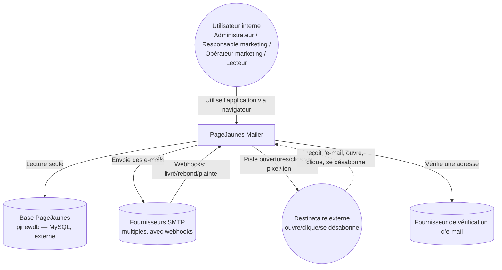
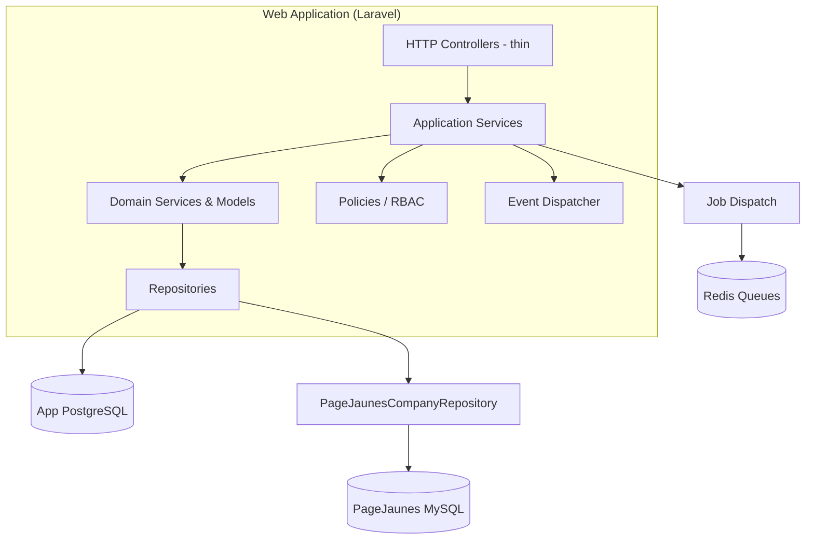
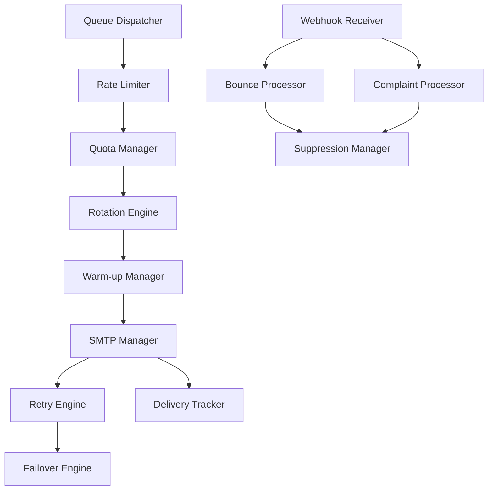
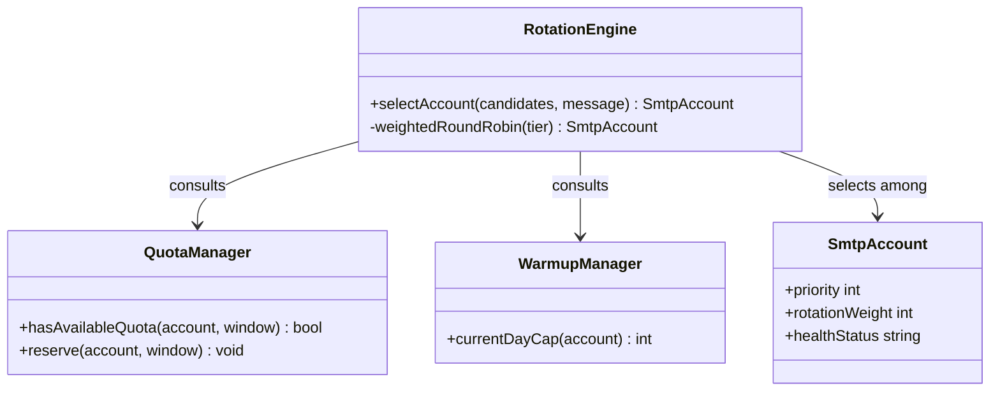

# 36 — C4 Architecture Model

## 36.1 Purpose

[02-system-architecture.md](02-system-architecture.md) already contains a Level 2 (Container) diagram and several sequence diagrams. This document completes the **full C4 model** (Context → Container → Component → Code) as a dedicated onboarding artifact, so a new engineer can zoom from "what is this system" down to "what does this one class do" without hunting across documents.

## 36.2 Level 1 — System Context

This is the single diagram to show a stakeholder who wants "what does this system talk to and why" without any internal detail. It corresponds directly to the actors named in [01-project-overview.md §1.5](01-project-overview.md#15-primary-personas) and the external systems in [06-pagejaunes-integration.md](06-pagejaunes-integration.md), [18-smtp-management.md](18-smtp-management.md), and [22-email-verification.md](22-email-verification.md).

## 36.3 Level 2 — Containers

This is the diagram already present at [02-system-architecture.md §2.4](02-system-architecture.md#24-component--container-diagram-c4-level-2); reproduced here for completeness of the C4 set with container responsibilities named explicitly:

| Container | Technology | Responsibility |
|---|---|---|
| Web Application | Laravel 12 (PHP 8.4) + Inertia + React, behind Octane/PHP-FPM | Serves the SPA, handles synchronous HTTP requests, authorization, validation |
| Queue Workers | Laravel Horizon-supervised PHP processes | Executes all queued jobs — sending, imports, health probes, report refresh |
| Scheduler | Laravel Scheduler (single cron-triggered instance) | Fires time-based jobs (campaign due-check, health probes, snapshot refresh) |
| App Database | PostgreSQL | System of record for all our own domain data ([04-database-design.md](04-database-design.md)) |
| Cache/Queue Store | Redis | Cache, Laravel queues, Horizon metrics, rate-limit/quota counters |
| Object Storage | S3-compatible | Attachments, import/export files |
| PageJaunes Database | MariaDB/MySQL, external, read-only | Source of company/email directory data |

## 36.4 Level 3 — Components (Web Application Container)

This mirrors the layered architecture in [02-system-architecture.md §2.2](02-system-architecture.md#22-layered-architecture) but framed as a C4 component diagram (boxes = deployable/instantiable components, arrows = runtime dependencies) rather than a conceptual layering diagram — useful when the question is specifically "what does the web container look like inside," as opposed to "what are our architectural layers."

## 36.5 Level 3 — Components (Delivery Engine, detailed)

This is the same decomposition as [17-delivery-engine.md §17.2](17-delivery-engine.md#172-service-decomposition), presented here as the canonical C4 Level 3 view for the container that matters most operationally:

## 36.6 Level 4 — Code (Illustrative, One Slice)

C4's Code level is normally auto-generated from the actual codebase (e.g. via a class diagram tool) rather than hand-maintained — hand-drawing every class would drift immediately. This document specifies **which slice to generate first and why**, as guidance for the implementation team rather than a diagram to maintain by hand:

Recommended first Code-level diagram to generate once implemented: the `DeliveryEngine` module's class relationships (above, illustrative) — it is the highest-risk, most-collaborated-on subsystem per [17-delivery-engine.md](17-delivery-engine.md), and a generated class diagram will catch coupling that crept in during implementation faster than a manually maintained one would.

## 36.7 How to Keep This Model Current

- Level 1 (Context) and Level 2 (Container) change only when a new external system or deployable unit is introduced — expect these to be stable for the life of v1 ([34-roadmap.md](34-roadmap.md) is the place new containers would first appear, e.g. if table partitioning introduced a dedicated reporting replica).
- Level 3 (Component) diagrams already live beside their owning document (17, 02) — update them there; this document only aggregates/cross-references, it does not duplicate ownership.
- Level 4 (Code) should be tool-generated against real code once it exists, not hand-maintained here — this document intentionally stops short of promising a maintained Code-level diagram to avoid the classic C4 failure mode of stale hand-drawn class diagrams.

Continue to [37-workflow-engine.md](37-workflow-engine.md).
