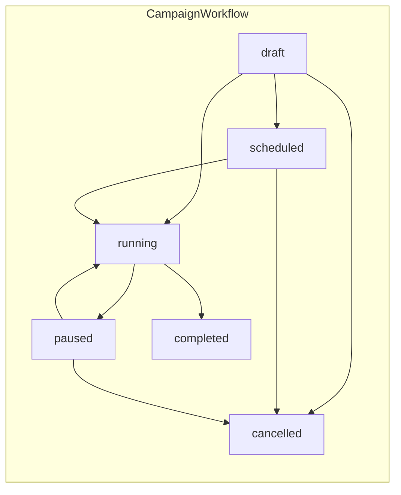

# 37 — Reusable Workflow / State Machine Engine

## 37.1 Problem

Four modules each independently define a lifecycle state machine with the same recurring shape (a fixed set of states, guarded transitions, side effects on transition, audit-logging of every transition):

| Module | State Machine | Doc |
|---|---|---|
| Campaigns | `draft → scheduled → running → paused/completed/cancelled` | [15-campaign-management.md §15.1](15-campaign-management.md#151-campaign-lifecycle-state-machine) |
| Importing | `pending → validating → processing → completed/completed_with_errors/failed` | [14-import-export.md §14.2](14-import-export.md#142-pipeline-stages) |
| SMTP Health | `healthy → degraded → unhealthy → disabled`, with cooldown-gated recovery | [18-smtp-management.md §18.5](18-smtp-management.md#185-health-monitoring), [19-throttling.md §19.5](19-throttling.md#195-automatic-pause--resume) |
| Messages | `queued → sending → accepted → delivered → opened/clicked`, plus bounce/failure branches | [20-delivery-tracking.md §20.1](20-delivery-tracking.md#201-status-lifecycle) |

Without a shared abstraction, each module reimplements: valid-transition checking, guard conditions, transition-triggered event dispatch, and audit-trail writing — a maintenance and consistency risk (a bug fixed in one module's transition-guard logic doesn't automatically get fixed in the others).

## 37.2 Design: A Shared `Workflow` Abstraction

A small, generic **domain-layer** (not infrastructure/package-level) abstraction, `App\Domain\Workflow`, consumed by each module's lifecycle service rather than replacing them:

```
App\Domain\Workflow\
  WorkflowDefinition        (states[], transitions[] with guards, side-effect hooks)
  WorkflowState             (value object: current state + metadata)
  Transition                (from, to, guard: callable, event: class-string<DomainEvent>)
  WorkflowEngine            (apply($subject, $transitionName): TransitionResult)
  Exceptions\InvalidTransitionException
```

`WorkflowEngine::apply()`:
1. Looks up the subject's `WorkflowDefinition` (one per module: `CampaignWorkflow`, `ImportJobWorkflow`, `SmtpHealthWorkflow`, `MessageWorkflow`).
2. Checks the requested transition exists from the current state; throws `InvalidTransitionException` (surfaced as HTTP 409 per [29-api-specification.md §29.1](29-api-specification.md#291-conventions)) if not.
3. Evaluates the transition's guard (e.g. `CampaignWorkflow`'s `draft → scheduled` guard checks `campaigns.approved_by` is set when review-before-sending is active, per [15-campaign-management.md §15.4](15-campaign-management.md#154-review-before-sending)).
4. Persists the new state.
5. Dispatches the transition's associated Domain Event (e.g. `CampaignSent`) — this is the **only** place a lifecycle transition may fire its event, so [31-events.md](31-events.md)'s catalog stays the single source of truth for "what fires when."
6. Returns a `TransitionResult` the calling Application Service uses to build its HTTP response.

## 37.3 Each Module's Workflow Definition (Declarative, Not Duplicated Logic)



Each module still owns its `WorkflowDefinition` (state names, guards, event mappings) — the engine is generic; the *content* of a workflow stays where the domain expertise lives (`Campaigns` module defines `CampaignWorkflow`, not a central "workflow config" file that every module edits). This is deliberate: a shared engine reduces duplicated *mechanics*, not duplicated *domain knowledge*.

## 37.4 What Explicitly Does NOT Move to the Workflow Engine

- **Segment/Recipient status** (`active`/`suppressed`/`invalid`) is a derived/denormalized flag, not a guarded lifecycle with transition rules of its own (suppression is one-way and triggered externally, verification can flip it either way) — it stays a plain column update, not a workflow.
- **Message status** ([20-delivery-tracking.md](20-delivery-tracking.md)) is a partial fit: it has many terminal branches and repeatable non-terminal events (multiple opens/clicks past a "final" status). It uses the engine for the linear backbone (`queued→sending→accepted→delivered`) but `message_events` remains the append-only log for repeatable events — the engine governs `messages.status`, not the full event history.
- **SMTP health** transitions are engine-governed but their *triggering signal* (bounce-rate threshold crossing, consecutive failures) stays in `ProbeSmtpHealthJob`/`FailoverEngine` as domain-specific evaluation logic; the engine only enforces "is `degraded → unhealthy` a legal transition right now" and fires the resulting event.

## 37.5 Benefits Realized

- **Consistency**: a single `InvalidTransitionException → 409` mapping in [29-api-specification.md](29-api-specification.md) covers all four modules instead of four bespoke error paths.
- **Auditability**: since every transition funnels through `WorkflowEngine::apply()`, a single `AuditListener` subscription pattern ([27-audit-logs.md §27.5](27-audit-logs.md#275-implementation-pattern)) can generically log "entity X transitioned from A to B" for any workflow-governed entity, rather than each module hand-rolling its own audit call.
- **Testability**: [32-testing.md §32.2](32-testing.md#322-unit-tests) gets a single reusable test harness (`WorkflowTestCase`) that any module's workflow definition can be run through to verify guard/transition correctness, rather than four bespoke state-machine test suites.

## 37.6 Non-Goals

This is **not** a generalized BPMN-style workflow engine, not user-configurable, and not exposed in the UI as an editable process — it is an internal code-organization pattern for the four lifecycles that already exist. Introducing a user-facing/configurable workflow builder is out of scope and would be a genuinely new product feature, not a refactor (see [34-roadmap.md](34-roadmap.md) if that's ever desired).

Continue to [38-rendering-pipeline.md](38-rendering-pipeline.md).
