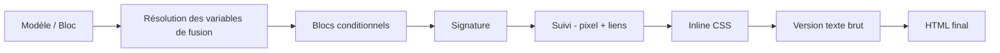

# 38 — Email Rendering Pipeline

## 38.1 Purpose

Content processing between "what the user authored" and "what actually gets sent" is currently described piecemeal across [11-email-composer.md §11.8](11-email-composer.md#118-html-processing-pipeline-pre-send) and [21-open-click-tracking.md](21-open-click-tracking.md). This document is the single authoritative, ordered pipeline — every module that touches outbound HTML must implement/consume these stages in this exact order, since later stages depend on earlier ones having already run (e.g. link-rewriting must happen after merge-variable resolution, or a merge variable inside an `href` wouldn't resolve before the link is rewritten).

## 38.2 The Pipeline

| Stage | Input → Output | Owning Component | Doc |
|---|---|---|---|
| 1. Template/Block source | Author's block structure or raw HTML | Composer/Templates block editor | [11-email-composer.md §11.2](11-email-composer.md#112-composer-modes), [12-template-system.md](12-template-system.md) |
| 2. Merge variable resolution | `{{recipient.first_name}}` → actual per-recipient value, with fallback defaults | `MergeVariableResolver` | [11-email-composer.md §11.4](11-email-composer.md#114-merge-variables) |
| 3. Conditional blocks | Segment-aware conditional content blocks evaluated and pruned per-recipient | `ConditionalBlockResolver` (roadmap-linked, see 38.5) | [34-roadmap.md §34.3](34-roadmap.md#343-explicitly-deferred-not-in-v1) |
| 4. Signature injection | User's selected `signatures.html_content` appended | `SignatureService` | [11-email-composer.md §11.3](11-email-composer.md#113-core-fields) |
| 5. Tracking injection | Pixel + link-rewrite to `click_links`/tracking tokens | `OpenTrackingService`, `ClickTrackingService` | [21-open-click-tracking.md §21.1–21.2](21-open-click-tracking.md#211-tracking-pixel) |
| 6. CSS inlining | `<style>` rules inlined to `style=""` attributes for email-client compatibility | `CssInlinerService` | [11-email-composer.md §11.8](11-email-composer.md#118-html-processing-pipeline-pre-send) |
| 7. Plain-text generation | HTML → plain-text alternative part (multipart/alternative), required for deliverability (38.4) | `PlainTextGeneratorService` | New in this document |
| 8. Final HTML/MIME assembly | Combines HTML part + plain-text part + attachments into the outbound MIME message | `SmtpManager` (send-time assembly, [17-delivery-engine.md §17.6](17-delivery-engine.md#176-smtp-manager)) | — |

## 38.3 Ordering Rules (Why This Exact Order)

- **Merge variables before conditional blocks**: a conditional block's condition may itself reference a merge variable's resolved value (e.g. "show this block if `{{recipient.custom_fields.industry}}` equals retail"), so resolution must happen first.
- **Conditional blocks before signature**: pruned/removed blocks must not leave orphaned tracking links or affect signature placement.
- **Signature before tracking injection**: any links within the signature (e.g. a social media icon) must also be tracked — injecting tracking after the signature is attached ensures full coverage rather than missing signature-embedded links.
- **Tracking before CSS inlining**: the tracking pixel `` tag and rewritten `<a href>` attributes must exist before the inliner processes the DOM, so the inliner's CSS rules apply consistently to tracking-injected elements too (e.g. a "read more" button style must still apply after its href is rewritten).
- **CSS inlining before plain-text generation**: plain-text generation strips all HTML/CSS anyway, so it must run last among the HTML-mutating stages to guarantee the plain-text part is derived from the truly final HTML (including any inlining side effects, like reordered/duplicated style-derived content that some inliners produce).
- **Preview mode ([11-email-composer.md §11.7](11-email-composer.md#117-preview-modes)) only runs stages 1–2 and 6** (template/blocks, merge-variable resolution using sample data, CSS inlining) — **never** stage 5 (tracking) or 7 (plain-text), consistent with the existing rule that previews must not generate tracking noise.

## 38.4 Plain-Text Alternative (New Requirement)

Every outbound message (transactional and campaign) is sent as `multipart/alternative` with both an HTML part and a generated plain-text part — not just for accessibility, but because **its absence is itself a spam-scoring signal** most providers penalize (cross-referenced in [39-deliverability-analyzer.md §39.3](39-deliverability-analyzer.md#393-check-catalog)). `PlainTextGeneratorService` derives the plain-text part from the final HTML (post-inlining) by: stripping tags, preserving link URLs as visible text (`Text [https://...]`), preserving basic paragraph/list structure, and appending the unsubscribe URL as plain text (mirroring the HTML footer's unsubscribe link, per [23-suppression-list.md §23.4](23-suppression-list.md#234-unsubscribe-workflow)).

## 38.5 Conditional Blocks (Cross-Referenced, Not a New v1 Commitment)

Stage 3 (Conditional Blocks) is listed in the pipeline **position** now so the ordering contract is complete and future-proof, but implementing segment-aware conditional content is listed as deferred in [34-roadmap.md §34.3](34-roadmap.md#343-explicitly-deferred-not-in-v1) ("send-time content personalization beyond merge variables"). In v1, stage 3 is a **no-op pass-through** — documenting its position now means adding it later is a slot-in, not a pipeline reordering that risks breaking the interaction rules in 38.3.

## 38.6 Where Each Stage Runs (Preview vs. Send)

| Context | Stages Run |
|---|---|
| Composer/Template preview ([11-email-composer.md §11.7](11-email-composer.md#117-preview-modes)) | 1, 2 (sample data), 6 |
| Campaign Wizard "Review" step preview ([15-campaign-management.md §15.2](15-campaign-management.md#152-campaign-wizard)) | 1, 2 (sample or real recipient), 6 |
| Actual send (transactional or campaign, executed inside `SendEmailJob`) | 1 through 8, full pipeline |

Continue to [39-deliverability-analyzer.md](39-deliverability-analyzer.md).
