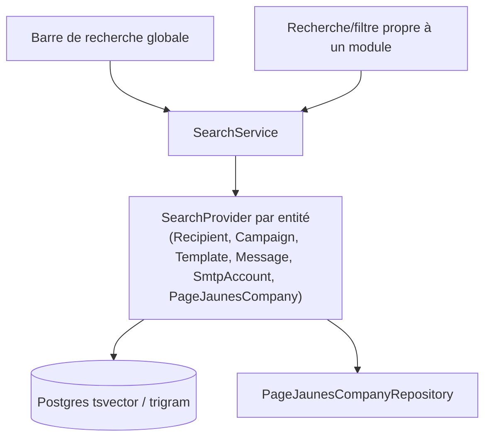

# 40 — Central Search Service

## 40.1 Problem

[08-navigation.md §8.4](08-navigation.md#84-navigation-behavior) already specifies a global Top Bar search "across Recipients, Campaigns, Templates, and Email History with grouped results." Left unspecified, this invites four independent, inconsistent search implementations (different ranking, different filter syntax, different pagination). This document defines the shared abstraction so global search — and each module's own in-page search/filter bar — is built on one engine.

## 40.2 Scope of Searchable Entities

| Entity | Searchable Fields | Owning Module |
|---|---|---|
| Recipients | `email`, `first_name`, `last_name`, `company_name` | Recipients ([13-recipient-management.md §13.6](13-recipient-management.md#136-search--filtering)) |
| PageJaunes Companies | `company_name`, `abv_company_name`, `address`, `about` (mirrors source fulltext index) | PageJaunes Integration ([06-pagejaunes-integration.md](06-pagejaunes-integration.md)) |
| Campaigns | `name`, `subject` | Campaigns ([15-campaign-management.md](15-campaign-management.md)) |
| Templates | `name`, `category` | Templates ([12-template-system.md](12-template-system.md)) |
| Messages / Email History | `subject`, recipient `email` | Tracking ([16-email-history.md](16-email-history.md)) |
| SMTP Accounts | `name`, `provider`, `from_email` | Delivery Engine ([18-smtp-management.md](18-smtp-management.md)) |

## 40.3 Architecture



`SearchService` is a thin coordinator, not a search index of its own: `search(query, scopes[]): SearchResultSet` fans out to only the requested `SearchProvider` implementations (each module registers its own provider, implementing a shared `SearchProvider` interface: `search(string $query, array $filters): Collection`), then merges/ranks results into grouped sections for the global search UI. Each provider still owns its own query logic (Postgres `tsvector`/trigram for our own tables, the existing `PageJaunesCompanyRepository::search()` for the external directory) — `SearchService` does not reimplement per-entity search, it **standardizes the calling contract and result shape** so the Top Bar can present one coherent grouped list instead of stitching together four different response shapes.

## 40.4 Shared Result Shape

```json
{
  "groups": [
    { "entity": "recipient", "label": "Destinataires", "results": [ { "id": "...", "title": "...", "subtitle": "...", "url": "/recipients/..." } ] },
    { "entity": "campaign", "label": "Campagnes", "results": [ ... ] }
  ]
}
```

Every `SearchProvider` returns results in this `{id, title, subtitle, url}` shape regardless of entity, which is what makes a single grouped-results dropdown component in the frontend possible (`Lib/api/search.ts` + one `<GlobalSearchResults>` component, not four bespoke result renderers) — consistent with the French-only display-label rules in [07-ui-design.md §7.12](07-ui-design.md#712-langue--français-uniquement) (group `label`s are always the French display name, never the internal entity key).

## 40.5 Module-Level Search Is Not Replaced

Each module's own in-page filter bar (e.g. Recipients' structured filters in [13-recipient-management.md §13.6](13-recipient-management.md#136-search--filtering), or Email History's date/status/campaign filters in [16-email-history.md §16.1](16-email-history.md#161-email-history-global-log)) keeps its richer, entity-specific filtering UI — `SearchService`/`SearchProvider` is specifically for the **lightweight, cross-entity, keyword-only** global search, not a replacement for structured per-module filtering. A module's `SearchProvider.search()` implementation is free to reuse the same underlying query building blocks as its full filter bar (e.g. Recipients' provider can call into the same repository method used by the structured filter grid, just with fewer parameters bound), which is exactly the DRY benefit of centralizing the *contract* without centralizing the *implementation*.

## 40.6 Ranking & Grouping in the UI

Global search results are grouped by entity type (never interleaved) with a configurable max-results-per-group (default 5, with a "see all results" link per group that navigates to that module's full search/filter page pre-populated with the query) — this avoids one large result set (e.g. Email History) crowding out a small one (e.g. Templates) in the dropdown.

## 40.7 Performance

Postgres `tsvector`/GIN indexes already specified per entity (e.g. [04-database-design.md §4.5](04-database-design.md#45-recipients-module) recipients, §4.9 SMTP accounts by name) back each provider; PageJaunes company search remains bound by the external MySQL fulltext index and the 5-minute Redis cache already described in [06-pagejaunes-integration.md §6.9](06-pagejaunes-integration.md#69-caching-strategy-application-level) — `SearchService` does not introduce a new caching layer beyond what each provider already does, to avoid a second source of staleness to reason about.

Continue to [41-notification-center.md](41-notification-center.md).
