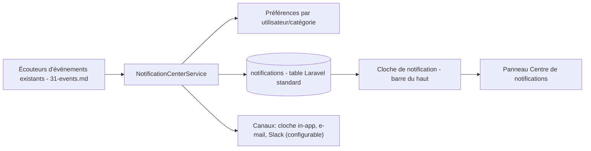

# 41 — Notification Center

## 41.1 Problem

[02-system-architecture.md §2.11](02-system-architecture.md#211-notifications) and the listener map in [31-events.md §31.2](31-events.md#312-event-catalog--listener-map) already establish that internal alerting flows through Laravel Notifications triggered by event listeners (`NotifyAdminListener`, `NotifyCreatorListener`, `NotifyCompletionListener`). Left as-is, each listener independently decides channel routing (database/mail/Slack) and each user has no single place to see/manage what they've been notified about. This document centralizes that into a proper **Notification Center**: a first-class in-app surface plus a consistent routing/preferences model, without changing which events already trigger notifications.

## 41.2 Scope (Reuses the Existing Event Catalog)

No new triggers are introduced — this document organizes the ones already specified:

| Trigger (from [31-events.md](31-events.md)) | Notification Category |
|---|---|
| `SmtpAccountHealthChanged` (degraded/unhealthy) | Delivery infrastructure |
| Quota near-exhaustion (threshold check inside `ReconcileQuotaLedgerJob`, [19-throttling.md §19.9](19-throttling.md#199-quota-monitoring)) | Delivery infrastructure |
| `CampaignCompleted` | Campaign activity |
| `CampaignApproved` (notifies the original creator) | Campaign activity |
| `ImportCompleted` / `ImportFailed` | Import activity |
| Queue backlog threshold exceeded ([24-queue-management.md §24.4](24-queue-management.md#244-dead-letter-queue-dlq)) | Delivery infrastructure |
| Bounce/complaint rate spike (part of `SmtpAccountHealthChanged`'s underlying signal) | Delivery infrastructure |
| `UserRoleChanged` (notifies the affected user) | Account/security |

## 41.3 Architecture

`NotificationCenterService` is a thin routing layer each existing listener calls **instead of** constructing/sending a Notification directly: `NotificationCenterService::notify(category, recipientUsers, notification)`. It consults the recipient's preferences (41.4) to decide which channels actually fire, then dispatches Laravel's standard `Notification` facade — this is a refactor of *where routing decisions are made*, not a new notification transport.

## 41.4 Per-User Preferences

### `notification_preferences` (schema addendum)
| Column | Type | Notes |
|---|---|---|
| id | bigserial PK | |
| user_id | bigint FK users | cascade delete |
| category | varchar(50) | `delivery_infrastructure`, `campaign_activity`, `import_activity`, `account_security` |
| channel | varchar(20) | `in_app`, `email`, `slack` |
| enabled | boolean | default true |

Unique (`user_id`, `category`, `channel`). Seeded defaults on user creation: `in_app` always enabled and **not user-disableable** for `account_security` (a user cannot silence their own role-change notice); everything else defaults on but is user-configurable in Settings → Notifications (personal section, distinct from the organization-wide Slack webhook configuration in [02-system-architecture.md §2.11](02-system-architecture.md#211-notifications), which remains an Administrator setting).

## 41.5 In-App Notification Center UI

- **Bell icon** in the Top Bar ([08-navigation.md §8.1](08-navigation.md#81-app-shell-layout)) with a `CounterBadge` for unread count.
- **Panel** (Fluent `Drawer` or `Popover`, consistent with other flyout patterns in [07-ui-design.md §7.5](07-ui-design.md#75-component-library-fluent-v9-primitives-mapped-to-app-usage)): reverse-chronological list grouped by day, each item showing category icon, message (French, per [07-ui-design.md §7.12](07-ui-design.md#712-langue--français-uniquement)), timestamp, and a deep link to the relevant entity (campaign, SMTP account, import job).
- Mark-as-read (individual or "tout marquer comme lu") and a link to a full-page "Historique des notifications" view for anything older than the panel's default window (last 30 days).
- Uses Laravel's standard `database` notification channel table (`notifications`: `id`, `type`, `notifiable_type`, `notifiable_id`, `data` jsonb, `read_at`) — no bespoke table needed beyond the framework default plus the preferences table in 41.4.

## 41.6 Relationship to Audit Logs

Notifications and [27-audit-logs.md](27-audit-logs.md) remain **distinct concerns** despite sharing the same event triggers: a notification is an ephemeral, user-facing, dismissible heads-up ("your import finished"); an audit log entry is a permanent, compliance-grade record ("user X changed SMTP credentials at time Y"). The same event (e.g. `SmtpAccountCredentialsUpdated`) can fan out to both an `AuditListener` (permanent record) and, if ever needed, a notification — but a notification being read/dismissed never affects the audit trail, and clearing notifications is never a way to "clean up" audit history.

## 41.7 Delivery Guarantees

Per [31-events.md §31.4](31-events.md#314-sync-vs-queued-listeners), all notification dispatch remains a **queued** listener (`ShouldQueue`) — a failure to send a Slack/email notification must never block or roll back the primary action (campaign completing, import finishing) that triggered it. The in-app (`database` channel) write is the one exception treated as best-effort-but-prioritized, since a missing bell notification is more user-visible than a missed email/Slack ping.

Continue to [README.md](README.md) for the full document index, now including this refinement set (35–41).
